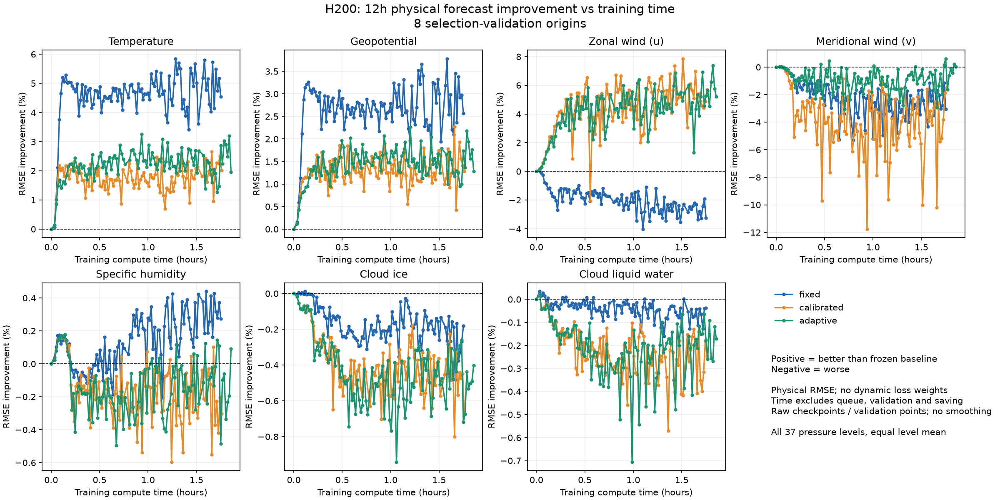
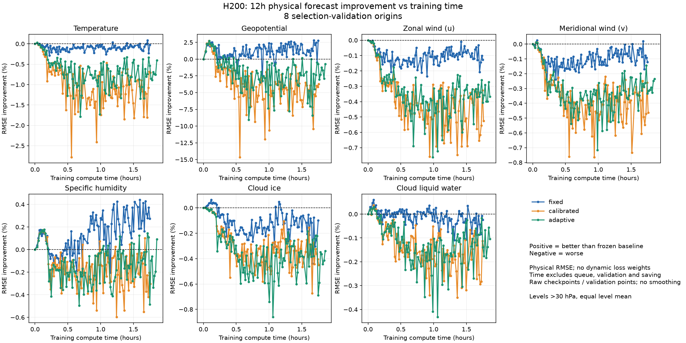
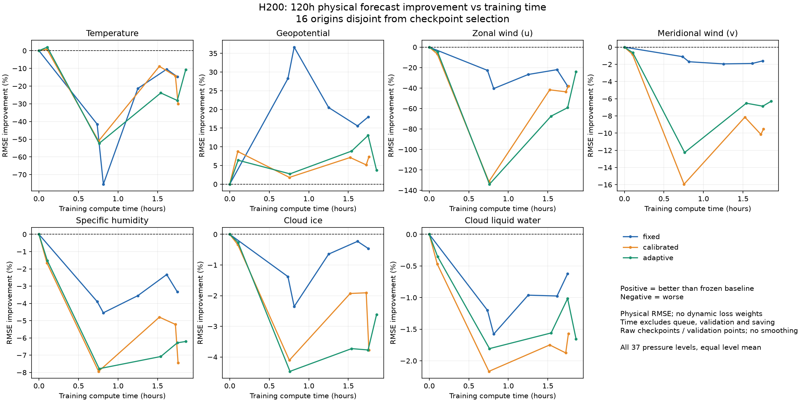
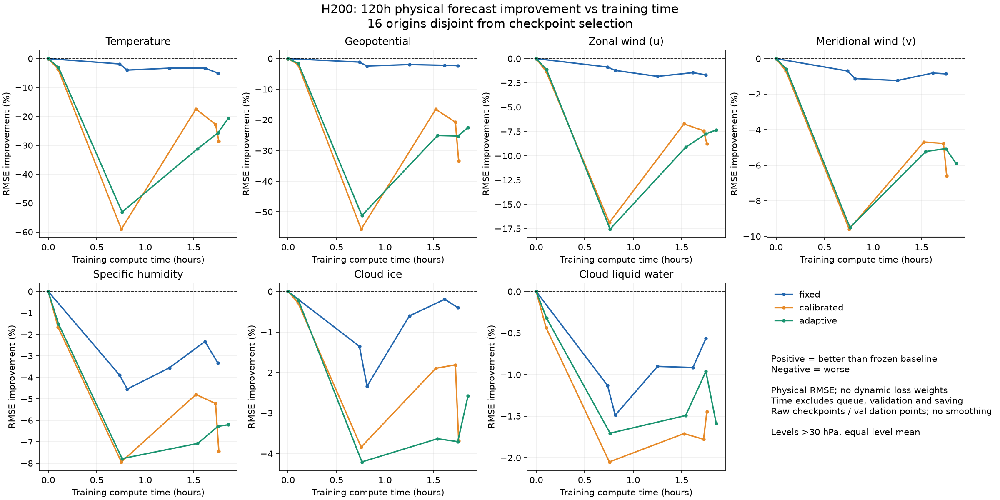

# 全变量物理评估随训练时间的变化

这是已完成的 H200 三组 2,000 步实验快照。三组训练和 15 个已存检查点的五天物理评估均已完成。原 A100 排队任务已按用户最新指示取消。GitHub 文件为本次发布快照。

[高空问题诊断与严格关层对照](DIAGNOSIS.md) · [逐层物理指标](pressure_level_detail.csv) · [滑窗权重与梯度记录](adaptive_probe_weights.csv) · [复现说明](REPRODUCIBILITY.md)

**改善率 = 100 × (frozen baseline RMSE − checkpoint RMSE) / frozen baseline RMSE。** 正值改善，负值变差。所有误差直接对ERA5计算，不使用训练loss权重。

覆盖全部7个直接对ERA5验证的输出：温度、位势、纬向风、经向风、比湿、云冰、云液水。每个变量的37个气压层均保留；模型内部native表示不是额外的独立观测变量，不混入这7项计数。

空间误差使用球面面积权重，跨起点平均MSE后开根号；变量总览再均匀合并所选气压层的MSE。提供全37层和>30hPa两个明确口径，避免只展示有利气压层。

横轴按本次用户要求使用累计training-step计算时间（小时），不含排队、步骤外初始化、验证和保存。CSV同时保留optimizer step。三组起始时间不同时，也各自从训练时间0计。

改善/变差计数使用±0.1%的显示容差，之间记为基本不变；不是统计显著性判据。baseline近零时标为无法定义，不强行计算巨大百分比。所有原始百分比仍保留。

## 最新计数

短时表按同一hardware三组共同拥有的最新step对齐；五天表按各自最新已评估checkpoint，step明确列出。

| GPU | 预测 | 层范围 | 模式 | step | 变量 改善/变差/近似不变 | 变量×层 改善/变差/近似不变/未定义 |
| --- | --- | --- | --- | ---: | --- | --- |
| H200 | 12h (short) | all_levels | fixed | 2000 | 3/3/1 | 89/88/82/0 |
| H200 | 12h (short) | all_levels | calibrated | 2000 | 3/4/0 | 32/207/20/0 |
| H200 | 12h (short) | all_levels | adaptive | 2000 | 3/2/2 | 52/164/43/0 |
| H200 | 12h (short) | weather_gt30hpa | fixed | 2000 | 2/2/3 | 73/55/75/0 |
| H200 | 12h (short) | weather_gt30hpa | calibrated | 2000 | 0/7/0 | 16/168/19/0 |
| H200 | 12h (short) | weather_gt30hpa | adaptive | 2000 | 0/6/1 | 24/137/42/0 |
| H200 | 120h (long) | all_levels | fixed | 2000 | 1/6/0 | 25/225/9/0 |
| H200 | 120h (long) | all_levels | calibrated | 2000 | 1/6/0 | 15/244/0/0 |
| H200 | 120h (long) | all_levels | adaptive | 2000 | 1/6/0 | 14/244/1/0 |
| H200 | 120h (long) | weather_gt30hpa | fixed | 2000 | 0/7/0 | 11/183/9/0 |
| H200 | 120h (long) | weather_gt30hpa | calibrated | 2000 | 0/7/0 | 2/201/0/0 |
| H200 | 120h (long) | weather_gt30hpa | adaptive | 2000 | 0/7/0 | 0/203/0/0 |

## 每个变量的真实改善曲线

## 证据与限制

- 短时曲线使用训练每20步已有的真实物理验证，8个固定起点，6h/12h；这些起点也用于checkpoint选择。
- 五天曲线来自不改动训练的checkpoint快照，另用16个固定起点、6–120h闭环前向；起点不参与短时选择，包含先前小试验已经观察过的部分起点。
- full-field和逐层RMSE分别保存在history与results JSON；CSV为每个变量的聚合值。baseline、源码、资源、统计与checkpoint哈希可追溯。
- 历史checkpoint只长期保留last/best。此前被覆盖的checkpoint没有伪造补跑：短时历史来自已保存的真实验证记录，五天时间点从现存best和本次起开始保存的快照取得。
- 单seed与小验证集的计数是描述性结果，不等于显著改善。失败checkpoint单独报告，不删除失败样本再计算指标。
- [逐变量CSV](variable_improvement.csv)、[全部改善记录](improvement_history.json)、[最新计数](latest_summary.json)、[评估计划](plan.json)。
