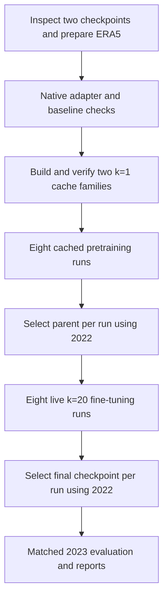

# NeuralGCM residual GC–Mamba pipeline

Implementation and experiment specification, 2026-09-19. The initial study uses
**2.8° and 1.4° pretrained deterministic NeuralGCM**, with **four width/inner-width
combinations at each resolution**. Every combination receives cached **k=1**
pretraining followed by live **k=20** closed-loop fine-tuning.

**Status:** specification, not an implemented NeuralGCM pipeline. Existing GC
residual and recurrent-training components are reusable, but the NeuralGCM
adapter, cache, training kernels and launcher below still need implementation.
Writing this document did not install models, preprocess data or submit jobs.
Future commands/configuration are marked as implementation contracts.

This supersedes the [initial plan](../neuralgcm_residual_resolution_plan_2026-09-19.md).
**“Four” means the 2×2 combinations, not four message-passing steps.** The 0.7°
checkpoint is deferred. The scope is the complete frozen NeuralGCM, including its
learned physics, rather than bare Dinosaur.

## 1. Matrix and fixed defaults

| Run ID | NeuralGCM resolution | Graph width | Mamba `d_inner` |
|---|---:|---:|---:|
| `r2p8_w128_di16` | 2.8° | 128 | 16 |
| `r2p8_w128_di32` | 2.8° | 128 | 32 |
| `r2p8_w256_di16` | 2.8° | 256 | 16 |
| `r2p8_w256_di32` | 2.8° | 256 | 32 |
| `r1p4_w128_di16` | 1.4° | 128 | 16 |
| `r1p4_w128_di32` | 1.4° | 128 | 32 |
| `r1p4_w256_di16` | 1.4° | 256 | 16 |
| `r1p4_w256_di32` | 1.4° | 256 | 32 |

For the initial seed this means **two cache families, eight pretraining runs and
eight corresponding fine-tuning runs**. Share each resolution's cache across all
four architectures. Train separate branch weights for every row. Do not select
one architecture at 1.4° and omit the other combinations from the initial matrix.

The resolutions and combinations are user-selected. Other entries below are
proposed first-run defaults, not measured optima:

| Setting | Default |
|---|---|
| Frozen components | NeuralGCM encoder, dynamics, learned physics and decoder |
| Graph message-passing steps | **2**, retaining the current compact branch depth |
| Mamba layers | 2 per graph step, **4 recurrent layers total** |
| Other Mamba settings | `d_state=16`, `d_conv=4`, `bc_groups=1`, `dt_rank=32`, Mamba1 initialization, dropout 0 |
| Mesh | Common level 4, subject to connectivity/resource preflight |
| Initialization | Fresh branch parameters and zero residual head; no GC weight overlay |
| Input history | One current native frame plus recurrent memory |
| Forecast/correction step | Six hours |
| Pretraining sequence | k=1, BPTT 24, chronological segments of 96 records |
| Fine-tuning | Exactly 20 predictions, loss at every lead, `closed_loop_sg` |
| Initial seed/batch | Seed 22, one chronological lane on one GPU per run |
| Precision | FP32 physical/recurrent state, normalization/loss, parameters and optimizer; optional BF16 branch projections after parity |

`d_inner` is the swept temporal width; `d_state` is a different dimension. Fix
`dt_rank` rather than using `auto`, which changes with graph width in our code.
Hold mesh, depth, features, initialization and data exposure fixed. If preflight
requires changing a fixed default, record it before production and apply it
consistently. Changing mesh/depth later is a separate experiment.

## 2. Native-state forecast contract

Let `E`, `B6h`, and `D` be the frozen encoder, six-hour forecast and decoder.

```text
s_0 = E(ERA5_at_origin, origin_forcing)
for j in 0 .. 19:
    delta_j, h_next = R_theta(native_features(s_j), h_j, known_features_j)
    b_next = B6h(s_j, origin_forcing)
    s_next = apply_native_increment(b_next, delta_j)
    prediction_next = D(s_next, origin_forcing)
    accumulate_loss(prediction_next, ERA5_at_origin_plus_6h_times_(j+1))
    s_j, h_j = s_next, h_next
```

The branch **does not receive the baseline forecast as an extra input**. Preserve
the complete corrected native state for subsequent calls, including time and
auxiliary carry. Encode only at initialization; do not decode/re-encode the
forecast every six hours. Decode for loss and output.

Initial gradient mode: **full closed-loop forward rollout, stop-gradient physical
feedback**. Retain gradients through the current branch output, through the frozen
decoder with respect to its input, and through Mamba memory inside BPTT. Detach
physical feedback before its next use, including next-step branch features;
exclude solver-state derivatives. Freezing decoder weights must not detach its
input. Full differentiation through the solver is an optional later experiment,
not implied by `k=20` and not implemented by the existing reverse pass.

## 3. Existing code and required implementation

| Existing component | Reuse | Change needed |
|---|---|---|
| [Residual model](../../../src/models/mamba/v24_Ilya/model.py) | Graph architecture, widths, zero head | Separate branch from GC baseline/task construction |
| [Vendored GraphCast](../../../third_party/graphcast/graphcast/graphcast.py) | Connectivity and interleaved graph/Mamba | General field schema/output size and native Gaussian coordinates |
| [Mamba module](../../../src/models/mamba/modules/temporal_mesh_mamba_Ilya.py) | SSM and convolution history | Preserve explicit state and precision semantics |
| [Cached stepwise trainer](../../../src/models/mamba/v24_Ilya/training/cached_stepwise.py) | Recurrent reverse pass/rematerialization | **New decoded-loss kernel**, native cached baseline and ERA5 target |
| [Cached runner](../../../src/models/mamba/v24_Ilya/training/cached_runner.py) | Cursor, chunk carry, logs | New reader/config and model-specific metadata |
| [Cached checkpoints](../../../src/models/mamba/v24_Ilya/training/cached_checkpoint.py) | Atomic save and resume pattern | Native schema, forcing, data/checkpoint identities |
| [Online endpoint step](../../../src/models/mamba/v24_Ilya/training/endpoint_step.py) | SG feedback and recurrent BPTT pattern | Native-state carry instead of GC two-frame/empty-baseline-state assumptions |
| [Metrics](../../../src/models/mamba/v24_Ilya/metrics.py) | Streaming sums and paired reductions | New named loss and Gaussian-grid weights |

The current cached kernel expects **physical residual targets**. It cannot train
the proposed decoded NeuralGCM loss unchanged. Its
[configuration](../../../src/models/mamba/v24_Ilya/training/cached_config.py) also
currently restricts execution to one device and batch size one. Start with that
execution scale and parallelize independent configurations.

Planned files, **not yet implemented**:

```text
src/models/neuralgcm_residual/
  config.py          # versioned architecture, stage and experiment contracts
  backbone.py        # frozen encode / advance_6h / decode
  native_state.py    # schema, units, nodal/modal conversion, safe increments
  model.py           # reusable residual graph/Mamba architecture
  data.py            # ERA5, regridding, causal forcing and split/origin manifests
  normalization.py   # train-only feature, correction and loss scales
  cache.py           # independent k=1 producer, verifier, streaming reader
  loss.py            # decoded ERA5 objective
  pretrain.py        # cached sequence training and carried TBPTT
  finetune.py        # live corrected native-state rollout
  evaluate.py        # cold/warm matched forecasts and diagnostics
  checkpoint.py      # exact resume versus intentional stage transfer
scripts/experiments/run_neuralgcm_residual.py
configs/experiments/neuralgcm_residual/
```

Keep NeuralGCM-specific work in adapters. Shared refactors need existing GC
regression checks. Preserve old GC cache manifests and producer identities;
consumer-only changes must not silently reinterpret or invalidate existing data.

## 4. Stage A — checkpoints, environment and unchanged baseline

1. Activate `scripts/graphcast_env.sh` for Python. Record dependency versions and
   check NeuralGCM/Dinosaur compatibility before installing anything. If necessary,
   define an isolated compatible environment with an explicit activation path;
   do not upgrade the environment used by current GC experiments in place.
2. Download the official `v1/deterministic_2_8_deg.pkl` and
   `v1/deterministic_1_4_deg.pkl` checkpoints from `gs://neuralgcm/models/`.
   Save hashes and license metadata. The weights use CC BY-SA 4.0.
   [Official checkpoint catalog](https://github.com/neuralgcm/neuralgcm/blob/main/docs/checkpoints.md).
3. Write a backbone manifest with actual `data_coords`, `model_coords`, vertical
   levels, internal timestep, field names, units, spectral masks and state tree.
4. Implement `advance_6h` using the checkpoint's timestep. `advance()` performs
   one internal step, **not necessarily six hours**; assert the resulting time.
5. Run unchanged one-step, 20-step and 40-step forecasts on fixed seasonal origins.
   Save metrics, diagnostics and a first resource profile.

Usual external grids are 128×64 and 256×128 (longitude×latitude) for 2.8° and
1.4°. Native solver grids are larger: inspect them rather than using external
data-grid dimensions for branch geometry. Pin checkpoint/library versions because
the native-state API is not guaranteed stable.
[State/API documentation](https://neuralgcm.readthedocs.io/en/stable/deepdive_into_models.html).

Start smoke work with `r2p8_w128_di16`; benchmark `r1p4_w256_di32` before committing
full-cache storage or production resource requests.

**Exit:** two pinned backbone manifests and reproducible unmodified forecasts.

## 5. Stage B — fields, native adapters and statistics

Proposed split: **2020–2021 train / 2022 validation / 2023 test**, identical at both
resolutions. Both selected backbones trained through 2017. Keeping the proposed
split from 2020 also permits a later 0.7° study, whose published model trained
through 2019. [Training details](https://arxiv.org/html/2311.07222v3#S7.SS2).

Prepare six-hour ERA5 with temperature, geopotential, u/v winds, specific humidity,
cloud ice and cloud liquid on the checkpoint's required pressure levels, plus
SST and sea ice. The current GC store does not include every needed field. Follow
the official conservative regridding and missing-value handling.
[Data preparation](https://neuralgcm.readthedocs.io/en/stable/data_preparation.html).

Use the official causal SST/ice convention: lag by 24 hours and persist the
origin's values for each forecast. Time/astronomical features may advance
deterministically. Future ERA5 is accessible to the target/loss only, not inputs
or forcing. [Forcing example](https://neuralgcm.readthedocs.io/en/stable/inference_demo.html).

| Field group | Branch treatment |
|---|---|
| Vorticity, divergence, temperature anomaly on sigma levels | Input and correction output |
| Water vapour, cloud ice, cloud liquid on sigma levels | Input and correction output |
| Log surface pressure | Input and correction output |
| Checkpoint geography, coordinates, known SST/ice and time features | Input only |
| Native time and auxiliary carry | Preserve; never add a learned residual |

At 32 levels the expected dynamic output count is **6×32+1 = 193**; validate the
actual schema. The solver state is spectral and nondimensional. Convert to nodal
features for the branch, then convert predicted increments back with the proper
units and spectral mask. Preserve checkpoint orography and reference temperature.
Use one native frame per call, with Mamba supplying temporal context. Extra derived
features are a later ablation, not a hidden difference between width/di arms.

Fit training-only input means/scales, correction scales and decoded loss scales.
They are distinct from NeuralGCM's own internal normalization. Use FP32 and
documented positive scale floors, particularly for clouds. Use Gaussian quadrature
weights rather than regular-grid cosine-latitude weights. Do not fit statistics
from validation/test data.

Keep history and forecast targets within their split. Drop boundary-crossing
windows and disclose incomplete segments/omitted timestamps. Verify the zero
increment preserves the solver state exactly; blanket clipping of the combined
state can change the baseline even when the branch output is zero.

**Exit:** prepared datasets, schemas, graph geometry, split/origin and statistics
manifests, and a verified native increment adapter.

## 6. Stage C — preprocess genuine k=1 predictions

For every valid consecutive six-hour timestamp:

```text
F_t       = causal_forcing_for_origin(t)
s_t       = E(ERA5[t], F_t)
b_t_plus1 = B6h(s_t, F_t)
y_t_plus1 = regridded_ERA5[t + 6h]
```

**The next record starts from `E(ERA5[t+6h])`, not `b_t_plus1`.** Cache independent
one-step predictions in chronological order, not a long baseline AR trajectory.
Store native origin and predicted states, the raw next-time pressure-level target
(or immutable reference), origin/valid times, forcing reference and compatibility
metadata. Keep the complete native carry needed by the decoder/adapter.

The producer manifest must explicitly contain:

```yaml
forecast_step_hours: 6
prediction_horizon_steps: 1
origin_state_policy: encode_truth_at_every_timestamp
physical_feedback: none
forcing_policy: lag24h_then_persist_for_one_forecast
```

Include checkpoint/schema/grid/units, source-data identity, producer code and
library versions, dtype, record counts and shard hashes. Producer identity must
be independent of branch width, seed and BPTT partition. Write `READY.json` only
after all required shards pass verification. Sample records against fresh live
calls. Never reuse the existing GC AR-k20 cache as this k=1 dataset.

In legacy v24 terms, this teacher-forced schedule corresponds to `ar_tail_k=0`
with BPTT greater than one. `target_steps=1` alone is insufficient.

Profile cache bytes/record and read throughput on a pilot shard. Compare compact
native/spectral storage with nodal storage and lossless compression; require a
lossless state round trip. Reference shared targets/static fields where practical.
Stream bounded shards with read-only cache arrays and owned work/prefetch buffers.
Do not load the multi-year cache into RAM or duplicate it for four architectures.

**Exit:** two verified train/validation cache families, completeness markers,
storage estimates and live-versus-cached reports.

## 7. Stage D — cached pretraining with carried BPTT

Each cached update uses the branch and frozen decoder, with no solver integration
or encoding in the optimization loop:

```text
delta_t, h_next = R_theta(native_features(cached_s_t), h_t, known_features_t)
corrected = apply_native_increment(cached_b_t_plus1, delta_t)
loss_t = weather_loss(D(corrected, cached_F_t), raw_next_time_ERA5)
```

The decoder must run on the changing corrected state, and its input derivative
must reach the branch. Native regression toward `E(ERA5_next)-cached_b` is an
optional cheaper proxy, not this primary objective: learned encoding/decoding is
lossy, so native-state regression is not identical to decoded forecast error.

Use 24 chronological one-step examples per BPTT update, with loss at every example:

```text
segment records  0..23: h0 → h24; optimizer update
segment records 24..47: detach(h24) → h48; optimizer update
segment records 48..71: detach(h48) → h72; optimizer update
segment records 72..95: detach(h72) → h96; optimizer update
new independent segment: reset SSM and convolution history
```

Carry values, detach gradient history at chunk boundaries. Reset only on unrelated
segments, gaps or split changes. Shuffle complete segments, never timestamps inside
one. Padding must not contribute loss or advance memory. Any future batch/distributed
runner needs separate chronological memory and cursor per lane.

Proposed initial optimizer: AdamW, LR 1e-4, betas (0.9, 0.98), weight decay 1e-4,
global gradient clipping 1, 200 warmup updates, then constant LR. Use **20 complete
passes over eligible training segments** for each of the eight runs as an initial
comparison budget. Record processed timestamps and updates. Extend only as an
explicit matrix-wide change supported by convergence evidence.

Save and run one-step validation after every data pass; run fixed five-day AR
validation at passes 0, 5, 10, 15 and 20. Transfer each arm's checkpoint selected
by the predeclared 2022 AR score, not by cached loss alone. Preserve final and
best-one-step checkpoints for diagnostics.

**Exit:** eight pretrained models with exact-resume state, learning curves and
one explicit selected parent per fine-tuning run.

## 8. Stage E — twenty-step live closed-loop fine-tuning

Load selected branch weights into the same architecture, restart optimizer and
schedule, and reset unrelated stream state. Do not change normalization/weights
between stages without versioning a new experiment.

Encode once at each forecast origin and run exactly **20 × 6h = 120h** of live
corrected-state feedback. Both backbone and branch receive the current corrected
state. Keep SST/ice fixed at the origin's permitted values. Supervise all 20
decoded outputs with uniform lead weights; average and update once per episode.
Use SG physical feedback and recurrent BPTT as defined in section 2. Cached baseline
trajectories cannot replace these calls because the solver inputs now change.

Proposed initial optimizer budget: LR 1e-5, 100 warmup updates, same betas/decay/clip,
then constant LR for **2,000 updates**. Save/validate every 200 updates. Benchmark
before turning this budgeting default into production resource requests; it is
not an assertion that 2,000 updates is optimal.

Use a seeded seasonally balanced ordering of eligible daily origins. Alternate
cold and warm episodes deterministically for the first protocol. Cold episodes
start with zero memory. Warm episodes consume observed states at
`t0-24h, t0-18h, t0-12h, t0-6h` as no-loss burn-in and detach terminal memory;
the first scored call consumes `t0` exactly once. Baseline initialization remains
at `t0`; the additional branch history must be disclosed. Evaluate cold and warm
separately.

Name the new setting `rollout_steps=20`. Old `ar_tail_k` counts feedback
transitions: a pure 20-prediction block maps to `bptt_steps=20, ar_tail_k=19`.
The new runner should assert valid times `6,12,...,120h` directly. Independent
episodes reset at their own origins. A later continuous >20-step TBPTT forecast
must carry **both** physical and recurrent state across chunks; it is a different
sampling protocol.

If k=20 transfer is unstable, inspect normalization and increment/pressure/moisture
diagnostics first. An explicit 1→5→10→20 curriculum is a possible fallback. Do not
silently insert clipping, periodic truth resets or teacher forcing after origin.

**Exit:** eight fine-tuned runs with parent identities, selected validation
checkpoints, stability diagnostics and measured costs.

## 9. Objective, validation and final report

Proposed decoded training loss:

```text
L = sum_v a_v * sum_level b_level *
    area_mean(((prediction[v, level] - ERA5[v, level]) / scale[v, level])**2)
```

Initially use all seven decoded fields, `a_v=1/7`, pressure-proportional normalized
level weights, training-only six-hour change standard deviations and documented
scale floors. Inspect cloud contributions before locking the objective; any
weighting revision must be versioned and shared across the matrix. Use proper
area weights on the verification grid. Native increment normalization is separate.

Call this **NeuralGCM-field normalized MSE**, not exact GraphCast loss or the
original NeuralGCM training objective. Compute reduction from aggregate errors:

```text
reduction_pct = 100 * (1 - aggregate_corrected_loss / aggregate_baseline_loss)
```

Do not average per-lead percentages or mix RMSE and MSE reductions. Validate on
32 fixed seasonal 2022 origins. Select checkpoints by **cold five-day aggregate
loss**; report warm skill separately. Seal 128 seasonal 2023 test origins and
evaluate **40 six-hour predictions = ten days**. Exclude split-crossing windows.

Evaluate frozen baseline, k=1-pretrained and k=20-fine-tuned branches on identical
origins/targets. Save per-origin scores for paired comparisons and block-bootstrap
uncertainty over dates. Report:

- Named aggregate loss and lead curves over days 1–5 and 1–10.
- Physical-unit RMSE/ACC for T850, Z500, Q700 and winds; clouds separately.
- Power-spectrum bias and correction spectra, so improvements caused by excessive
  smoothing are visible.
- Pressure/mass drift, water-field validity and failed/nonfinite forecasts; never
  silently omit a failed origin from only one side of the comparison.
- Trainable parameters, recurrent memory, cache build/storage, GPU-hours and added
  inference latency. Amortize cache production across its four arms explicitly.

Use each checkpoint's native output grid for primary paired verification.
Additionally use one common coarse verification grid and fixed training-derived
scales for absolute cross-resolution comparisons. That secondary score does not
measure the extra fine-scale information at 1.4°.

Follow-up after the single-seed matrix: a matched **trained** no-memory branch
at each resolution, and seeds 23/24 for selected configurations. Resetting memory
only at evaluation is useful diagnostically but does not replace a trained control.

## 10. Numerical checks, resume and stage transfer

Require the following at both resolutions before production:

1. Zero residual reproduces unchanged NeuralGCM through 20/40 steps, including
   native time/auxiliary carry and decoded forecasts.
2. Live and cached k=1 paths agree on loss, gradients, memory and one update,
   using nonzero residuals and nonzero incoming memory.
3. Chunked carry and contiguous execution agree in forward outputs/final memory
   at fixed weights. Cross-boundary gradients intentionally truncate in TBPTT.
4. Forecast times and forcing/history access satisfy the exact horizon/causality
   contract. Both SSM and convolution states reset at actual discontinuities.
5. Frozen model parameters remain unchanged; decoder-input derivatives reach the
   branch; all physical feedback derivatives stop while within-chunk h gradients survive.
6. Exact resume restores weights, optimizer, RNG, cursor and memory. Save physical
   state/origin forcing too for mid-episode checkpoints; otherwise save only at
   episode boundaries. Validation must not mutate training memory or cursor.
7. Establish FP32 parity before enabling BF16 neural computation. Record errors
   and predeclared tolerances; investigate discrepancies rather than widening a
   tolerance after failure without explanation.

**Resume** continues all numerical state. **Pretrain→fine-tune transfer** loads
branch weights and compatible metadata but deliberately resets optimizer, cursor
and unrelated history. Record these as different operations. Any stabilizer must
be a no-op at zero correction, or identically applied to the baseline.

## 11. Artifacts and job dependencies

Proposed output layout:

```text
data/neuralgcm/
  checkpoints/<checkpoint_sha256>/
  prepared/<dataset_id>/{res2p8,res1p4}/{train,val,test}/
  cache_k1/<producer_id>/{res2p8,res1p4}/{train,val}/
artifacts/checkpoints/neuralgcm_residual/<experiment_id>/
  manifest.json                  # eight arms, locked defaults and budgets
  source/                        # executed source snapshot/dependency identities
  configs/<run_id>.json
  manifests/                     # splits, validation/test origins
  baselines/{res2p8,res1p4}/
  checks/{res2p8,res1p4}/
  runs/<run_id>/seed22/pretrain/
  runs/<run_id>/seed22/finetune/
  evaluation/<run_id>/
  reports/
  logs/
```

Each stage writes resolved config, data/cache/statistics/checkpoint identities,
metrics and exact-resume checkpoints. Fine-tuning names/hashes its selected parent.
Reject schema/grid mismatches rather than silently resizing or recomputing
statistics. Preserve completed outputs and immutable producer manifests.



Cache jobs run per resolution/time shard; verification depends on every required
shard. Pretraining depends on successful verification. Each fine-tune depends on
its own pretrain/selection. Evaluation/reporting depend on complete upstream
outputs. Record job IDs and `afterok` dependencies. Partial cache completion must
not release production consumers.

## 12. Planned launcher contract — not runnable yet

The following script and schema **do not exist yet**. These examples define the
intended interface; they are not commands supported by existing v24 launchers.

```bash
source scripts/graphcast_env.sh

# Future: write eight configurations/manifests and an immutable source snapshot.
python scripts/experiments/run_neuralgcm_residual.py prepare \
  --experiment-root artifacts/checkpoints/neuralgcm_residual/res2p8_res1p4_w128_256_di16_32

# Future: inspect the planned submission without sending jobs to Slurm.
python scripts/experiments/run_neuralgcm_residual.py submit \
  --experiment-root artifacts/checkpoints/neuralgcm_residual/res2p8_res1p4_w128_256_di16_32 \
  --stage preflight --dry-run

# Future worker: execute inside an allocated job using a generated config.
python scripts/experiments/run_neuralgcm_residual.py execute \
  --experiment-root artifacts/checkpoints/neuralgcm_residual/res2p8_res1p4_w128_256_di16_32 \
  --stage pretrain --run-id r2p8_w128_di16
```

Stages: `preflight`, `data`, `cache`, `verify-cache`, `pretrain`, `finetune`,
`evaluate`, `report`. Shared stages select resolution/shard; training selects run
ID. `prepare` writes definitions, `submit` schedules, `execute` performs worker
work. Exact resume requires a compatible checkpoint; do not implicitly restart
a nonempty output directory. Held-out evaluation requires locked selection manifests.

Illustrative **new-schema specification**, not accepted by today's v24 loader:

```yaml
schema: neuralgcm_residual_v1
matrix:
  resolutions: [2.8, 1.4]
  residual_widths: [128, 256]
  temporal_d_inner: [16, 32]
  seeds: [22]
architecture:
  mesh_size: 4
  residual_msg_steps: 2
  temporal_layers: 2
  temporal_d_state: 16
  temporal_d_conv: 4
  temporal_bc_groups: 1
  temporal_dt_rank: 32
  temporal_init_scheme: mamba1
  temporal_stateful: true
  temporal_dropout: 0.0
  residual_initialization: fresh
  zero_residual_head: true
forecast:
  step_hours: 6
  state_space: neuralgcm_native
  baseline_frozen: true
  forcing_policy: lag24h_then_persist_at_origin
pretrain:
  cache_horizon_steps: 1
  cache_origin_policy: encode_truth_at_every_timestamp
  loss: decoded_era5_normalized_mse_v1
  bptt_steps: 24
  segment_steps: 96
  state_boundary: carry_values_detach_gradients
  epochs: 20
  learning_rate: 1.0e-4
finetune:
  rollout_steps: 20
  feedback_mode: closed_loop_sg
  loss_steps: all
  episode_mode: alternate_cold_and_warm4
  max_updates: 2000
  learning_rate: 1.0e-5
evaluation:
  validation_year: 2022
  test_year: 2023
  selection_metric: cold_5day_neuralgcm_field_normalized_mse
  forecast_steps: 40
```

## 13. Resource profiling and completion

Measure small 2.8° and largest 1.4° shapes before setting production budgets.
Separate compilation from steady-state timing. Record cache bytes/record and
producer throughput, reader wait, branch+decoder backward cost, live 20-step
time, CPU RSS and peak GPU memory. Existing GC job budgets do not establish the
cost of this new pipeline.

Start with one GPU per run and independent jobs for the arms. CPU RAM and GPU
VRAM are separate budgets. Use measured profiles and accounting to set resource
requests; no array concurrency throttle unless explicitly requested. Report total
cost only after profiling, including validation and cache production.

Completion requires two verified cache families, all eight arms completing both
training stages with explicit parents, matched held-out forecasts, and a report
of per-resolution capacity comparisons, gains from pretraining versus fine-tuning,
cold/warm results, spectra, failures and compute/storage costs. Resolve any
zero-residual baseline mismatch before interpreting model improvements.
