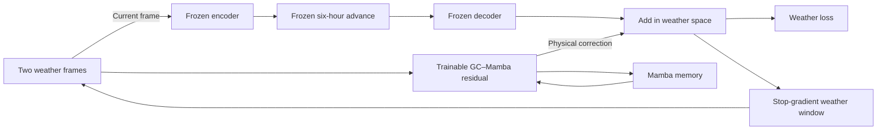

# NeuralGCM weather-space residual: alignment with the GC residual architecture

Date: October 3, 2026. **Status: design proposal. This architecture has not been implemented or trained.** This README is the deliverable for the architecture discussion.

**October 7 evidence update:** the [standalone test review](../../docs/experiments/ngcm_test_review_20261007/REPORT.md)
documents positive native K20 checkpoints, remaining forecast regressions, and a
failed evaluation watcher. Native K20 remains a comparison baseline for this
proposal; the weather-space architecture has not yet demonstrated an advantage.

The proposed change moves the residual from NeuralGCM's native prognostic state to its decoded weather fields. The residual branch will use two weather frames, an independent graph network with Mamba memory, 24-step memory BPTT, and memory carry within a 96-step segment. This requires a new forward path and training loop, rather than a different `K` setting in the existing runner.

The reference is the **frozen GraphCast + independent GC–Mamba residual branch** on `minimalistic_code`, pinned at commit `4b318ee488cb3820f8819c956f4691aa09e57239`. GraphCast itself and the residual branch are separate components. The initial implementation will follow the fresh width128 residual configuration. Pretrained GC input/output projections will not be transferred into an incompatible NGCM field schema.

Existing native K2, native K20, and learning-rate control runs use the old architecture. Their checkpoints and smoke tests do not validate this proposal. Weather experiment code and results belong in this repository's `residual_NGCM` branch.

## 1. Architecture changes

| Component | Existing native K2 implementation | Proposed weather-space implementation |
| --- | --- | --- |
| Correction location | Add to the native state after its six-hour advance, then decode | Add directly to the frozen model's decoded weather prediction |
| Predicted correction | Native vorticity, divergence, temperature variation, tracers, etc. | Physical corrections to T, Z, u, v, q, cloud ice, and cloud liquid water |
| Residual input | One current native state and known features | Two weather frames, six hours apart, plus known features |
| Direct supervision path | Residual → native adapter → decoder → weather loss | Residual → physical scaling → addition → weather loss |
| Weather feedback | Continue advancing the corrected native state | Re-encode the corrected weather prediction before the next advance |
| Memory training | Two steps per origin, then reset | BPTT over 24 steps; carry memory across chunks within 96 steps |
| Weather gradient | Stop-gradient feedback | GC `closed_loop_sg`; retain gradients through the current residual and memory |
| Correction scale | Native-channel statistics of encoded next truth minus the advanced baseline | Per-variable, per-pressure-level six-hour weather-difference statistics |
| Loss normalization | Separate 24-hour difference statistics, pooled across levels for most fields | Per-variable, per-level six-hour weather-difference statistics |
| Loss representation | Native/data spectral representations with spectrum and bias terms; strict-mask runs disable the native term | Normalized weather-grid MSE with area and pressure weights |

The last three rows are accompanying training choices. They must be recorded separately from the correction location and memory changes. A successful combined configuration would establish that the proposed system works; it would not identify one change as the sole cause of improvement.

## 2. Forward computation and gradients

Let `E` be the frozen encoder, `Φ6h` the six-hour advance including learned physics, and `D` the frozen decoder. Let `x_t` denote pressure-level weather and `h_t` the residual's Mamba state.

```text
Weather window:          [x_(t-6h), x_t]
Frozen forecast:         b_(t+6h) = D(Φ6h(E(x_t, f)), f)
Residual and memory:     r̂_(t+6h), h_(t+6h) = Rθ(normalize(window), known, h_t)
Physical correction:     δ_(t+6h) = scatter_to_full_levels(σΔ · r̂_(t+6h))
Corrected forecast:      y_(t+6h) = stop_gradient(b_(t+6h)) + δ_(t+6h)
Next weather window:     stop_gradient([x_t, y_(t+6h)])
```

All parameters in `E`, `Φ6h`, and `D` remain frozen. The current correction is added **after** decoding, so its direct loss gradient no longer passes through the decoder Jacobian. Subsequent weather feedback passes through the frozen model numerically, but gradients along that feedback path are stopped. Memory gradients remain connected within a chunk and are detached between chunks.



As in the GC reference, the residual does not receive the baseline forecast or latent state as an additional input. The branches share weather conditions. The existing NGCM encoder accepts one pressure-level frame: **the residual receives two frames, while the frozen NGCM backbone re-encodes the current frame**. This preserves an explicit difference from GraphCast's two-frame backbone.

For each variable and pressure level, the normalized residual target is:

```text
target_residual[v,p] = (truth[v,p] - stop_gradient(baseline_on_current_inputs[v,p])) / σΔ[v,p]
```

The baseline must be evaluated on the actual current inputs. Once autoregressive inputs differ from truth, a baseline cached from truth inputs is no longer the correct target. With identical fixed scales and weights, MSE on the corrected forecast must equal MSE against this residual target; this equivalence needs a test.

## 3. Re-encoding changes the frozen baseline

Native NGCM inference encodes once and then advances its internal state continuously. The proposed wrapper re-encodes corrected weather every six hours. It cannot assume:

```text
E(D(native_state)) == native_state
```

Weather fields do not necessarily represent every internal state component, and the encoder/decoder are learned mappings. Thus a zero-residual wrapper may differ from native NGCM over multiple steps. The size of this effect has not been measured for the current checkpoint. The [official NGCM API](https://neuralgcm.readthedocs.io/en/latest/api.html) describes the pressure-level and internal-state interfaces; implementation will be checked against the installed 1.2.2 source.

Evaluation must retain three paths:

| Name | Computation | Purpose |
| --- | --- | --- |
| `native_baseline` | Encode once, then continuously advance native state | Original NeuralGCM benchmark |
| `weather_wrapper_zero` | Encode → advance → decode every step, with zero residual | Isolate the effect of the feedback interface |
| `weather_residual` | The same wrapper with a learned weather correction | Evaluate the proposed architecture |

A zero output head must reproduce `weather_wrapper_zero`. Starting from identical inputs, the wrapper must also reproduce the native baseline's first six-hour forecast. **Zero residual does not establish five-day equivalence to native NGCM.** All paths must share initial conditions, forcing policy, precision, and evaluation origins.

The first implementation task is a zero-residual comparison at 6/12/24/72/120 hours for all seven variables and 37 levels, with a separate >30 hPa summary. The proposed engineering gate is no more than 1% RMSE degradation against native NGCM for any variable in the >30 hPa aggregate at either 12 or 120 hours. This is a proposed pre-training criterion, not a statistical significance claim. If it fails, investigate the feedback interface before full training and retain all measurements.

Report both improvements:

```text
Improvement over native NGCM = 100 × (1 - RMSE(weather_residual) / RMSE(native_baseline))
Improvement over the wrapper = 100 × (1 - RMSE(weather_residual) / RMSE(weather_wrapper_zero))
```

Improving only over the wrapper may mean the residual compensates for re-encoding error. It does not establish an improvement over original NGCM.

Two alternatives require separate architecture names:

- **Output-only postprocessing:** correct reported weather without feeding it into the physical model. This preserves the native backbone rollout but differs from GC's closed-loop residual.
- **Incremental native feedback:** investigate an update such as `z_next = z_base + [E(y_corrected) - E(y_base)]`. This could preserve the baseline when the residual is zero, but the actual state includes time/carry components that require explicit treatment. Decoding the updated state need not reproduce the desired weather correction. This alternative needs its own state adapter and closure tests; it is not part of the primary proposal.

## 4. Two-frame inputs, output fields, and units

The first implementation will retain the NGCM 2.8° Gaussian grid and all 37 input pressure levels. Each window is `[t-6h, t]` and contains:

```text
temperature                              K
geopotential                             m²/s²
u_component_of_wind, v_component_of_wind   m/s
specific_humidity                        kg/kg
specific_cloud_ice_water_content          kg/kg
specific_cloud_liquid_water_content       kg/kg
```

Fix channel order as `(time, variable, pressure_level)` and record its schema/hash. The weather input has `2×7×37=518` channels, with known features added separately. Each batch lane owns its weather window, memory, and clock; unrelated origins must never share state.

Preserve the user's exclusion of upper-atmosphere targets. The first head will produce corrections only for the **29 pressure levels with p > 30 hPa, giving 7×29=203 output channels**. Scatter these into the full 37-level field. Direct corrections at ≤30 hPa are zero, which is stronger than setting their loss weights to zero. All levels remain available to the next encode and to evaluation. Physical coupling may still change later upper-atmosphere predictions.

This differs from GC-small's 13 levels and 83 output channels. Some GC surface fields and vertical velocity are absent from the current NGCM outputs; NGCM includes cloud water. The proposal keeps the NGCM field schema and also reports T/Z/u/v/q on the common 13-level subset.

During autoregression, every uncorrected field or level must come from the rollout's own frozen forecast. Do not fill upper levels, cloud water, or other inputs from future ERA5 truth. Truth is available only for the defined teacher prefix and supervision.

The new head does not output surface pressure, vorticity, or divergence. Existing `no_pressure_zero_mean_v2` native-increment constraints therefore do not transfer directly. Weather corrections may affect these quantities through encoding. Log encoded surface pressure, mean drift, and water anomalies; do not claim the old constraints remain enforced or silently introduce clipping/projection.

### Forcing and time

Retain the project's lag24h SST/sea-ice information policy. Teacher windows use lagged forcing available at their current observed time. Autoregression holds the lag24h snapshot available at the last observed time, without reading future observations. Cold evaluation holds the forecast origin's lag24h snapshot throughout the trajectory. Every comparison uses the same policy.

Calendar features and `sim_time` advance on the actual six-hour clock. Static features are mapped to the weather grid. Split forcing retrieval from weather-truth retrieval so an AR call cannot accidentally consume current ERA5 weather through a combined helper.

## 5. Memory carry and weather feedback are separate

The primary sequence configuration follows the GC reference:

```yaml
sequence:
  input_offsets_hours: [-6, 0]
  step_hours: 6
  segment_steps: 96
  bptt_steps: 24
  ar_tail_k: 20
  truth_prefix_steps: 4       # derived: bptt_steps - ar_tail_k
  temporal_state_policy: carry
  weather_feedback: closed_loop_sg
  loss_mode: all_steps
```

A segment contains four chronological chunks. Each chunk produces one optimizer update using 24 supervised predictions, each weighted by `1/24`.

| Position | Weather window | Mamba memory | Gradient boundary |
| --- | --- | --- | --- |
| New segment | Construct a prefix from consecutive truth frames | Reset | Start a new graph |
| First four calls of a chunk | Use truth windows; the fourth prediction seeds feedback | Update each step | Keep memory gradients |
| Remaining 20 calls | Roll predictions forward; the first AR window still includes one truth history frame | Update each step | Stop weather gradients; keep memory gradients |
| After step 24 | Rebuild the next chunk's truth prefix | Carry final values | Detach memory at the update boundary |
| After step 96 | Start the next segment | Reset | No gradient across segments |

**A 96-step segment carries memory. It is neither a 96-step uninterrupted weather forecast nor 96-step full BPTT.** The backward window remains 24 steps. Carried memory is the value computed during the preceding forward pass; updating parameters does not trigger a recomputation of that history, consistent with the reference runner.

A segment with 96 consecutive prediction origins requires 98 weather timestamps: the preceding history frame, all origin frames, and the final target. Forcing requires additional earlier context. Validate six-hour continuity and all context/target/forcing split boundaries. Do not treat 96 files as a complete segment, pad missing timestamps, or borrow context across train/validation/test splits.

## 6. Replace ambiguous K labels with explicit horizons

The GC reference defines `truth_prefix_steps = bptt_steps - ar_tail_k`. The final fully observed input window already produces a one-step forecast. The following `ar_tail_k` calls consume forecast feedback:

```text
endpoint_forecast_steps = ar_tail_k + 1
endpoint_lead_hours = 6 × endpoint_forecast_steps
```

| Named preset | BPTT | AR tail | Truth prefix | Endpoint after the last observed input |
| --- | ---: | ---: | ---: | ---: |
| `short_12h` | 24 | 1 | 23 | 2 steps = 12h |
| `gc_tail2` | 24 | 2 | 22 | 3 steps = 18h |
| `long_120h` | 24 | 19 | 5 | 20 steps = 120h |
| **`gc_reference_tail20`, primary long configuration** | **24** | **20** | **4** | **21 steps = 126h** |

The earlier request to train K2 before K20, interpreted as 12h → 120h, maps to `short_12h → long_120h`. Literal GC AR-tail settings of 2 and 20 mean 18h and 126h endpoints. The proposed initial curriculum is `short_12h → gc_reference_tail20`, with evaluation fixed at 12h and 120h as well. Use the separately named `long_120h` preset if the training endpoint must be exactly 120 hours, and report that difference from the reference.

Both stages retain 24 supervised calls and 24-step memory BPTT. Most weather calls in the short stage use truth inputs; this is different from the old K2 loop with two loss times followed by a memory reset.

Evaluation has a separate `eval_forecast_steps=20/40`: genuinely free forecasts of 120h/240h from the initial observation, without a teacher prefix. BPTT length, AR tail, and evaluation horizon must not share an overloaded `K` label.

## 7. Normalization and accompanying objective

Fit weather input `mean[v,p]` and `std[v,p]` on training data only. Scale corrections and residual targets with a separate six-hour weather-difference standard deviation `σΔ[v,p]`. Do not reuse native correction scales or the mostly level-pooled 24-hour loss statistics. The old native head's output scale and the old loss scale are different artifacts and should not be conflated.

Both stages and their controls share frozen statistics with recorded sampling, training dates, schema, and content hashes. For zero or very small cloud-channel variances, the proposed floor is `max(scale[v,p], 1e-3 × median_positive_scale[v])`, calculated separately for input and difference statistics. Record every floored level; fail on nonfinite values or fields without any positive scale. This is an explicit NGCM extension, not the original GC statistics. Do not use one unit-independent epsilon or estimate scales from validation data.

The GC-style objective is:

```text
L = mean_over_batch_and_24_steps(
      sum_over_fields α[v] ×
      mean_over_selected_levels_and_grid(
        area_weight[lat] × pressure_weight[p] ×
        (r̂[v,p] - target_residual[v,p])²))

pressure_weight[p] = p / mean(selected_pressures)
```

Use Gaussian-grid area integration weights normalized to unit mean. All 29 selected levels have their own scales before pressure weighting. Set `α=1` for T/Z/u/v/q and initially retain `α=0.05` for each cloud field. Cloud fields are an explicit extension because they are absent from this GC reference task.

The primary GC-aligned configuration excludes native loss, spectrum/bias terms, and sliding-window adaptive weighting. Preserve the existing adaptive implementation separately and later compare fixed/adaptive weighting within the new architecture. Otherwise the architecture and a changing objective would be mixed together.

For controlled comparisons, support a separately named objective preset that converts direct weather predictions to the modal data representation required by the old strict-mask loss. This bridge changes only the loss representation; it does not move corrections back into native state. Results across different objective presets cannot establish a single-factor architecture effect.

## 8. Residual network, optimizer, and budget

Start with fresh width128 and GC's grid→mesh→processor→grid structure. Use two processor message-passing steps, two Mamba layers per insertion point, and four recurrent layers in total. Set `d_inner=16`, `d_state=16`, `d_conv=4`, `bc_groups=1`, `dt_rank=32`, Mamba1 initialization, convolution bias enabled, and dropout zero. Initialize the weather output head to zero. Enable the temporal output-projection zero-initialization flag as in the fresh GC reference; this differs from the current native branch and must be recorded.

Retain the NGCM Gaussian grid and current mesh4, with connectivity checks. The GC reference uses a 1° grid and mesh5, so spatial discretization is not identical. Initially use FP32 for parameters, the weather tape, and memory. BF16 acceleration requires a separate numerical comparison.

Proposed optimizer: AdamW with peak LR `1e-4`, 200 warmup updates, betas `(0.9,0.98)`, epsilon `1e-8`, global gradient clipping at 1, and weight decay `1e-4` on all residual parameters, following the reference decay policy. Each initial stage runs 2,000 updates with cosine decay to `1e-5`, batch size one time lane, and seed 22. This is a 2k engineering experiment; the GC reference's 10k schedule has a different budget.

After an independent pilot, complete 2k and evaluate saved checkpoints. A stage transition is a **warm start**: load selected parameters from the new weather architecture, reset optimizer/memory/cursor, and record a new stage schedule. Within-stage recovery is a **resume**: restore all training state exactly. Old 193-channel native heads and their Adam moments are incompatible with the new 203-channel weather head. Report cumulative updates and supervised predictions when comparing a short→long curriculum with fresh long-stage training.

## 9. Planned standalone code layout

Only this README exists for the new architecture. The following modules are implementation targets, not runnable commands:

```text
experimental/weather_space_residual/
  README.md                 # Architecture proposal
  config.py                 # Architecture ID, presets, fields, levels, time contract
  field_schema.py           # 518 input channels, 203 outputs, full-level scatter
  weather_backbone.py       # E → Φ6h → D; native and wrapper baselines
  features.py               # Weather inputs, static features, causal forcing
  model.py                  # Independent GC/Mamba branch and weather output head
  statistics.py             # Train-only per-field/level input and 6h difference scales
  objective.py              # GC-style MSE and explicitly named legacy-loss bridge
  segments.py               # 96 origins, 24-step chunks, prefixes, data cursor
  trainer.py                # Weather stop-gradient, memory BPTT, chunk updates
  checkpoint.py             # Atomic parameters/optimizer/memory/RNG/cursor save
  evaluate.py               # Three paths, all fields/levels, 120h/240h forecasts
  preflight.py              # Independent representative-data and real-NGCM checks
  lifecycle_smoke.py        # Recovery across chunk/carry boundaries
```

Reuse the frozen checkpoint loader, ERA5 prepared store, grid/unit checks, GC/Mamba graph operators, and atomic I/O utilities. The forward path and sequence loop require new implementations: swapping a loss object in `TrajectoryTrainer` would retain native-state corrections and resets at each origin.

Use a distinct architecture ID and schema/checkpoint version. Save parameters, Adam state, update count, RNG, each lane's Mamba SSM/convolution state, segment ID, offset, epoch, stage, statistics/forcing/data/source/baseline identities, and committed validation/model-selection records. Weather prediction buffers need not cross chunk boundaries because the next chunk starts from truth, but its time cursor and forcing selection must be reproducible.

Commit checkpoints only after complete optimizer updates. An interrupted partial chunk is replayed from the last committed state without accepting partial updates or duplicate committed logs. Slurm allocation boundaries must not introduce extra memory resets.

## 10. Implementation order and smoke-test criteria

1. **Validate the weather wrapper first.** Implement the frozen step and compare all three paths with zero residual. Check fields, units, clocks, and repeated-encoding error through five days. No residual training is needed at this stage.
2. **Implement the two-frame weather residual.** Check the zero head, 203 outputs, 37-level scatter, and zero direct corrections at excluded levels. Verify parameter gradients reach the current residual without passing through the decoder or being accidentally detached with future feedback.
3. **Implement the GC sequence contract.** Compare 24-step/4-prefix/20-AR indexing against the reference. Check one loss per target, weights of `1/24`, numerical memory carry over 96 steps, and distinct chunk/segment boundaries. Verify the 12h/120h presets independently of their AR-tail labels.
4. **Run real-data and recovery tests.** Use independent pilot statistics and representative data. Complete a full 96-step segment and the start of the next one. Compare uninterrupted execution with independent-process recovery at offsets 24/48: parameters, Adam, RNG, memory, cursor, and counters must agree. Confirm exactly one reset at the next segment. Gradient checks must cover a short direct-autodiff reference and the real 24-step memory backward pass.
5. **Then run 2k training and checkpoint evaluation.** Start with `short_12h`, followed by an explicitly named long preset from Section 6. Existing native K20 training does not substitute for these tests.

Also test two common silent failures. Perturbing future truth within the AR interval may change targets/losses but must not change the predictions or weather inputs in that forward pass. On a fixed feedback tape, weather gradients must stop at feedback boundaries while memory gradients remain connected across steps. Structural exclusion in both the output scatter and loss does not imply upper-level inputs have no influence through the network or physics.

All GPU smoke tests use H200 `--partition=ailab --qos=gpu-test`, with allocations of at most one hour. Split longer checks into bounded jobs with explicit checkpoint boundaries. Code, pilot statistics, outputs, and production artifacts stay on scratch. Continuing training uses one-hour allocations and approximately 55-minute boundaries, saving complete chunks and resuming without a 500-update slice cap.

## 11. Evaluation and architectural attribution

Cold evaluation starts with two observed frames `[t-6h,t]` and zero Mamba memory. Roll forward freely for 20 or 40 steps, without a teacher prefix or a memory reset at step 24. Evaluation origins never share memory.

Report physical RMSE for all seven fields and all 37 levels, plus >30 hPa and the common 13-level subset. Show the native baseline, zero-residual wrapper, and trained model together. Aggregate squared errors before taking square roots; improvement percentages must not use adaptive loss weights. Retain step 0, the final checkpoint, and the best checkpoint selected by a predefined validation rule. Independent long-range evaluation origins must not be reused for retrospective checkpoint selection. Reserve 2023 for the final test.

Train controlled comparisons under the same objective, optimizer, origins, and field schema:

- Two weather frames versus a control that removes information from the previous frame.
- 24-step memory gradients versus truncation every two steps, retaining the same 24 supervised weather calls and prefix.
- Memory carry within 96 steps versus reset at each chunk, retaining the weather sequence.

These require retraining. Disabling memory only at inference is not a controlled training ablation.

A correction-location comparison requires a native-output branch with the same two weather inputs, sequence, objective, and weather feedback wrapper as the new branch. Record differences in head shape, native scales, and constraints. Existing short-K native models are historical references, not this single-factor control. Implement this comparison after validating the primary interface.

Training plots continue to use cumulative training compute time as explicitly requested, while CSVs retain optimizer updates, supervised prediction counts, and stage. Changing from two to 24 targets per update changes exposure; equal update counts alone do not imply equal budgets. Decreasing training loss, finite forecasts, or improvement over the re-encoded wrapper alone is insufficient evidence of better long-range forecasts than original NeuralGCM.

## 12. Source references

- [GC residual model and zero head](https://github.com/Reminguch/Weather_Global/blob/4b318ee488cb3820f8819c956f4691aa09e57239/src/models/mamba/v24_Ilya/model.py): independent weather-input branch and direct residual output.
- [GC 24/96/AR20 configuration](https://github.com/Reminguch/Weather_Global/blob/4b318ee488cb3820f8819c956f4691aa09e57239/configs/experiments/v24_Ilya/res1_optimizer_matrix_20260904/mamba1_di16_bcg1_lr1em4_b1p9_b2p98_cos10k.json) and [fresh width128 notes](https://github.com/Reminguch/Weather_Global/blob/4b318ee488cb3820f8819c956f4691aa09e57239/docs/experiments/v24_res1_width128_mamba1_ablation.md): sequence, optimizer, model, and initialization choices.
- [GC sequence configuration](https://github.com/Reminguch/Weather_Global/blob/4b318ee488cb3820f8819c956f4691aa09e57239/src/models/mamba/v24_Ilya/training/config.py#L293), [endpoint step](https://github.com/Reminguch/Weather_Global/blob/4b318ee488cb3820f8819c956f4691aa09e57239/src/models/mamba/v24_Ilya/training/endpoint_step.py#L1090), and [runner](https://github.com/Reminguch/Weather_Global/blob/4b318ee488cb3820f8819c956f4691aa09e57239/src/models/mamba/v24_Ilya/training/runner.py#L1030): prefix/AR indexing, weather stop-gradient, memory BPTT, and segment boundaries.
- [Existing NGCM training kernel](../../docs/experiments/gc_vs_ngcm_20261003/evidence/ngcm/trajectory_training.py) and [native branch](../../docs/experiments/gc_vs_ngcm_20261003/evidence/ngcm/model.py): forward computation and memory boundaries to replace.
- [Frozen backbone adapter](../../src/models/neuralgcm_residual/backbone.py), [data/forcing loader](../../src/models/neuralgcm_residual/data.py), [native normalization](../../src/models/neuralgcm_residual/normalization.py), and [24-hour loss statistics](../../docs/experiments/gc_vs_ngcm_20261003/evidence/ngcm/paper_statistics.py): existing interfaces and separate scaling artifacts.
- [Earlier GC/NGCM diagnosis and result tables](../../docs/experiments/gc_vs_ngcm_20261003/diagnostic.md): motivation and hypotheses that still require controlled experiments.
