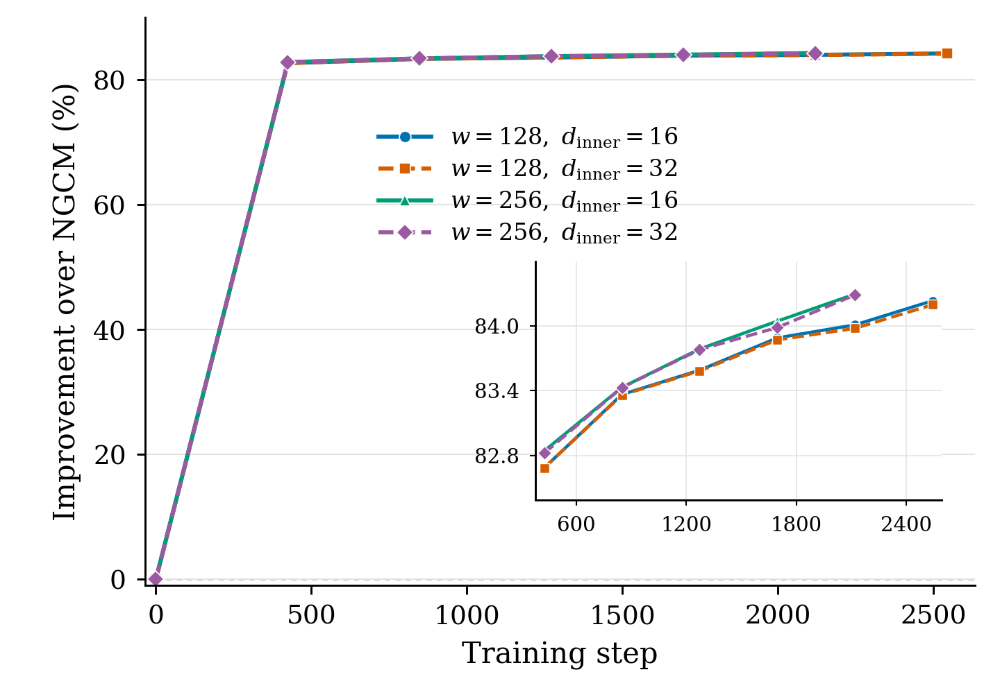

# K=1 improvement versus training step



**Caption.** Relative reduction in the `neuralgcm_pooled_change_mse_v2`
validation objective compared with frozen NGCM during K=1 pretraining at 2.8°.
Improvement is `100 × (1 − residual_NGCM_loss / NGCM_loss)`.
**Training step counts optimizer updates**, as requested for training plots.
Markers show initialization and completed epochs, with 424 updates per epoch.
The inset enlarges the post-initialization points using the same units on both
axes. All configurations use the same 1,455 six-hour validation forecasts from
2022 and seed 22. The baseline loss is **1.1389527632198793**.
Only checkpoints with matching completed-validation receipts enter the snapshot.
Training is ongoing, so each curve ends at its latest completed validation.

[PDF](k1_improvement_vs_training_step.pdf) ·
[SVG](k1_improvement_vs_training_step.svg) ·
[CSV data](k1_improvement_vs_training_step.csv) ·
[Provenance and rollout context](k1_improvement_vs_training_step.provenance.json)

**Physical-variable follow-up:** [six-hour predictions versus ERA5 and NGCM](k1_physical_eval_20260924/README.md)
now provides all seven variables, fixed-start time axes in 6 h increments,
and full-year physical-unit errors. The aggregate improvement is concentrated
in upper-atmosphere geopotential; standard-level forecast errors can worsen.

## Current snapshot

Captured on **September 24, 2026 at 12:44:00 UTC / 08:44:00 EDT** from
`res2p8_w128_256_di16_32_train2015_2021_20260924_feedback_v2`.

| Configuration | Completed epoch | Training step | K=1 validation loss | Improvement |
| --- | ---: | ---: | ---: | ---: |
| w128 / di16 | 6 | 2,544 | 0.179594 | 84.23% |
| w128 / di32 | 6 | 2,544 | 0.180016 | 84.19% |
| w256 / di16 | 5 | 2,120 | 0.178896 | 84.29% |
| w256 / di32 | 5 | 2,120 | 0.178983 | 84.29% |

## Interpretation and multi-step validation

These are **single-step reductions of the new custom objective**, not evidence
of improved five-day forecast skill. At epoch 5, all four models completed all
32 cold and warm validation origins, but their five-day rollout losses were
substantially worse than frozen NGCM.

| Configuration | Cold five-day mean loss | Ratio to NGCM |
| --- | ---: | ---: |
| w128 / di16 | 123.950 | 85.69× |
| w128 / di32 | 123.083 | 85.09× |
| w256 / di16 | 100.314 | 69.35× |
| w256 / di32 | 102.711 | 71.01× |

The common five-day baseline loss is 1.446498353779316. The provenance file
includes the corresponding cold/warm summaries and their source hashes.
Formal K=20 fine-tuning had not started at snapshot time.

This snapshot replaces the previous `20260920_scatter_v3` data. The restart
uses `no_pressure_zero_mean_v2` corrections and a revised loss with pooled change
scales and field weights. Its percentages must not be compared directly with
those of the previous objective. The old metric-audit file was removed from this
directory because it evaluates the superseded loss and checkpoints. Historical
data remain in Git history. See the
[restart description](../docs/experiments/neuralgcm_residual/FEEDBACK_V2_RESTART_20260924.md)
for the current contracts and the
[previous instability audit](../docs/experiments/neuralgcm_residual/INSTABILITY_AUDIT_20260924.md)
for the earlier diagnosis.

## Reproduce

Python and Matplotlib are sufficient. From the repository root, redraw all three
figure formats from the committed CSV without access to the experiment files.

```bash
python plot/plot_k1_improvement.py
```

Refresh CSV, provenance, and figures from the current experiment with

```bash
python plot/plot_k1_improvement.py --experiment-root /path/to/20260924_feedback_v2_experiment
```

When publishing a later snapshot, update this README's timestamp and tables too.
The provenance records the source identity, loss/correction contracts, validation
and checkpoint hashes, completion receipts, and the exact metrics prefix.
CSV timing columns are retained as source metadata; the horizontal coordinate
uses only `update`. The main plot has no embedded title, subtitle, caption, or
endpoint annotations.
