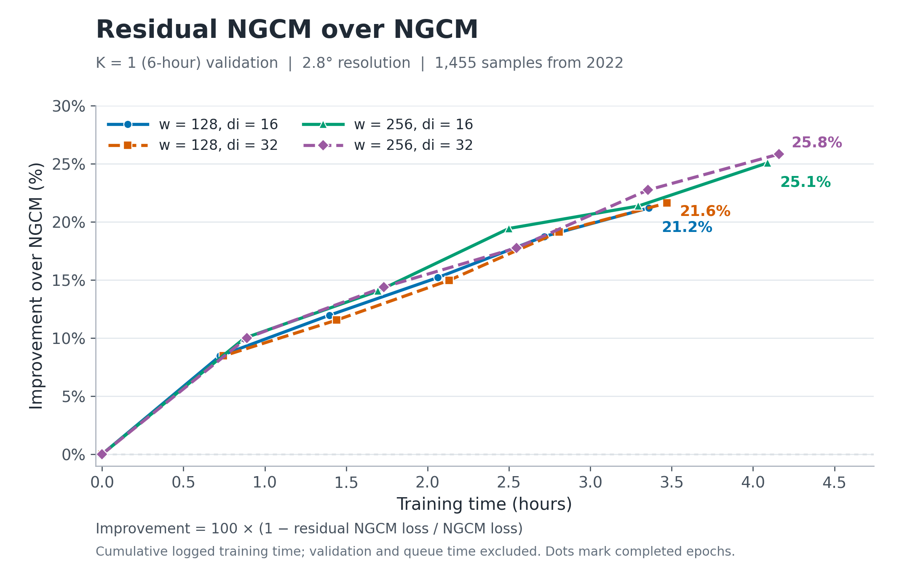

# K=1 improvement over NGCM



[PDF](k1_improvement_vs_training_time.pdf) ·
[SVG](k1_improvement_vs_training_time.svg) ·
[CSV data](k1_improvement_vs_training_time.csv) ·
[Source provenance](k1_improvement_vs_training_time.provenance.json)

Snapshot taken on September 24, 2026 UTC (September 23 EDT). All four configurations
have completed one-step validation at initialization and after epochs 1–5.
Each validation uses the same 1,455 records from 2022, at 2.8° resolution and a
6-hour forecast horizon. Training uses 2015–2021 data and seed 22.

## Axes and baseline

- **Improvement (%)** = `100 × (1 − residual_NGCM_loss / NGCM_loss)`.
  Positive values indicate lower validation loss. Loss is the existing
  `neuralgcm_field_normalized_mse_v1` metric, averaged over seven decoded weather
  fields with Gaussian area weights, pressure-level weights, and training-data
  normalization scales. This is a normalized MSE reduction, not an RMSE reduction.
- **NGCM loss** is `20832.350542310996`, obtained from epoch-0 one-step validation.
  The residual output head is initialized exactly to zero, so this prediction
  equals the frozen NGCM prediction. All four runs have the identical initial
  validation loss. Existing numerical checks also report exact zero-residual
  equality with NGCM and exact cached/live loss agreement.
- **Training time (hours)** is the cumulative `seconds` in `metrics.jsonl` through
  the update stored in each epoch checkpoint's JSON metadata, divided by 3,600.
  These timers cover cache record loading and training computation, including
  compilation inside the timed loop. They exclude validation, checkpoint writes,
  data/cache preparation, queue time, and other untimed overhead. This is logged
  training-loop time, not end-to-end Slurm elapsed time or GPU kernel time.
- Markers are measured validation results. Lines connect those measurements
  without smoothing or extrapolation. `w` denotes model width and `di` denotes
  the Mamba inner width.

## Latest included measurements

All endpoints are epoch 5, update 2,120.

| Configuration | Logged training time (h) | Residual NGCM loss | Improvement |
| --- | ---: | ---: | ---: |
| w128 / di16 | 3.359 | 16,419.299 | 21.18% |
| w128 / di32 | 3.471 | 16,329.756 | 21.61% |
| w256 / di16 | 4.089 | 15,612.177 | 25.06% |
| w256 / di32 | 4.159 | 15,454.735 | 25.81% |

These are **K=1 validation measurements during pretraining**. The recurrent
memory is carried over chronological validation records, with the physical
input reset to the encoded observed state for each forecast. They do not measure
20-step closed-loop skill. Three runs stopped during the subsequent epoch-5
closed-loop validation, after their complete one-step results were written.
Their one-step results remain included here. The fourth run was still training
when this snapshot was taken. The curves describe these observed runs and are
not a controlled hardware performance comparison.

## Reproduce

Only Python and Matplotlib are required. From the repository root, redraw the
committed CSV without access to the training machine or a GPU:

```bash
python plot/plot_k1_improvement.py
```

To refresh from the original experiment's existing files:

```bash
python plot/plot_k1_improvement.py --experiment-root /path/to/experiment
```

The experiment directory name is
`res2p8_w128_256_di16_32_train2015_2021_20260920_scatter_v3`.
The provenance JSON records its original path, frozen source identity,
checkpoint metadata and validation hashes, and the hash of the exact metrics
prefix used per run. Extraction verifies shared dataset, normalization and
backbone identities, matching validation counts, and uninterrupted update
numbering. Only updates through the last available one-step validation are
read, so an ongoing run cannot add unmatched timing to a plotted point.

The CSV preserves full-precision losses and timing. PNG, PDF, and SVG exports
are generated from that same CSV. No model execution is needed to draw the plot.
