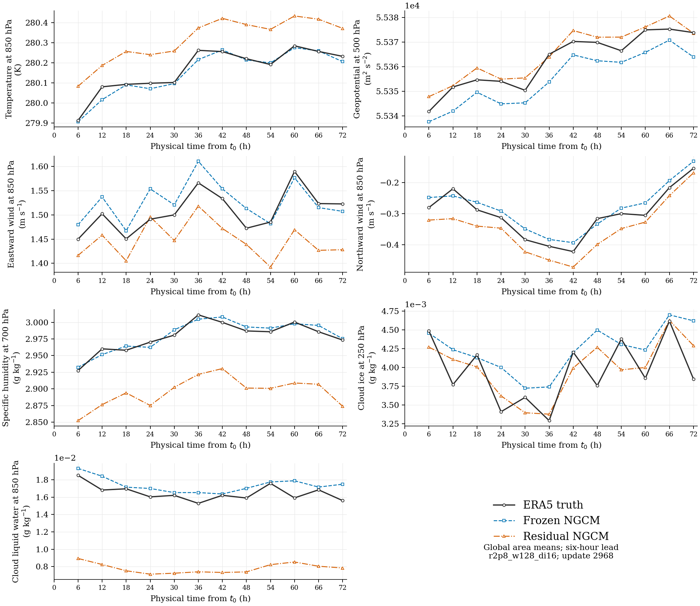
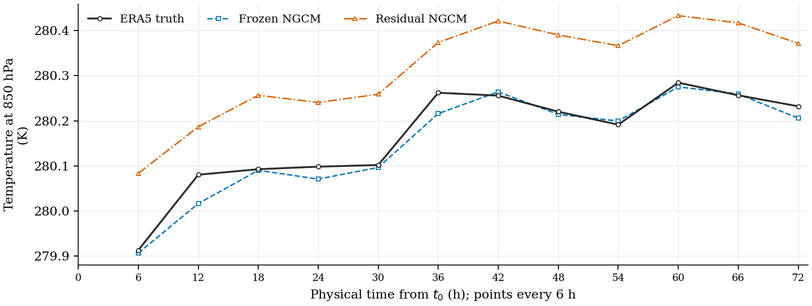
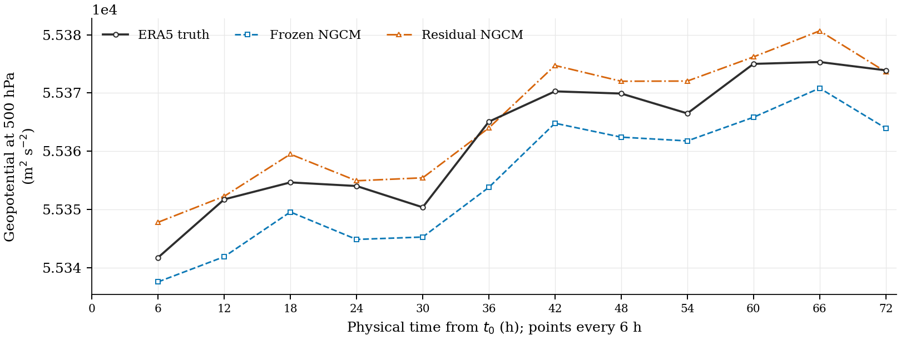
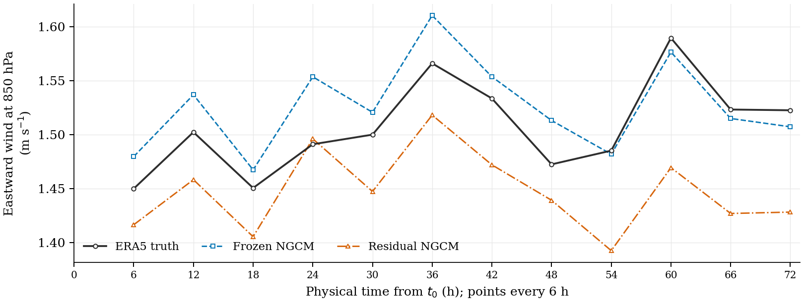
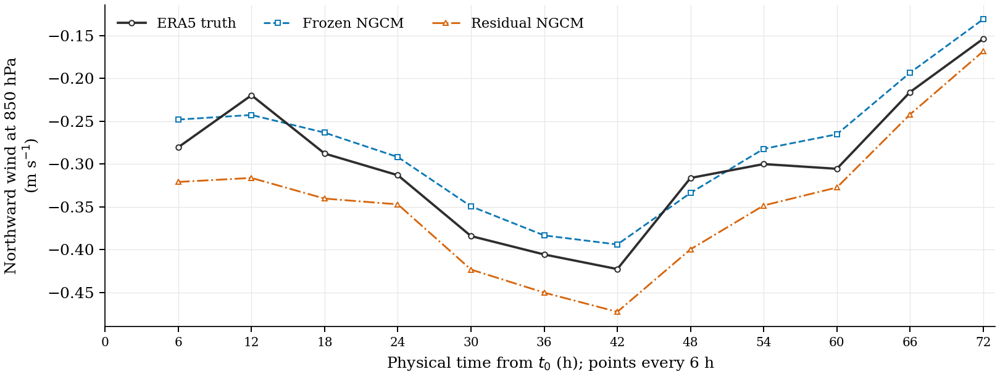
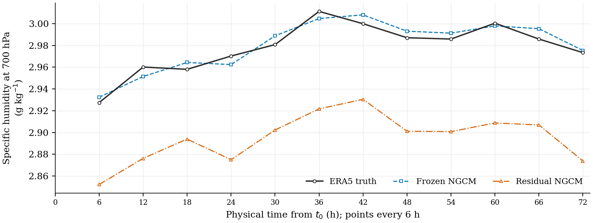
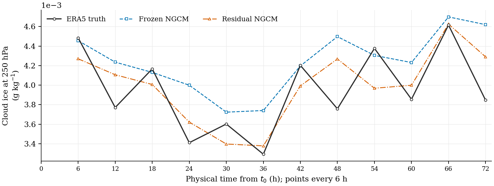
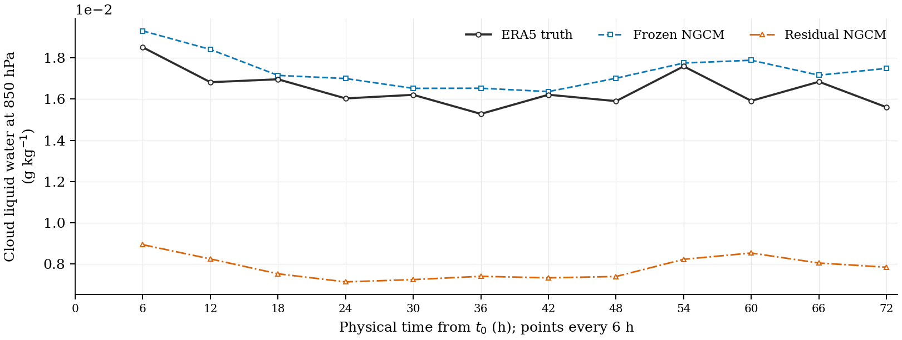
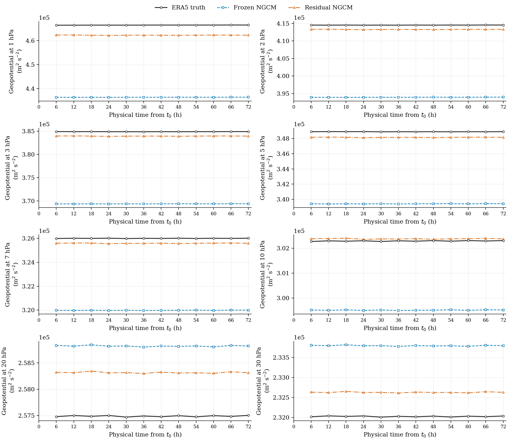

# NeuralGCM residual: loss comparisons and physical forecasts

> **The original README loss, the running v2 loss, and the 24 h simplified
> loss are different definitions.** The training-step loss curves rescore the same
> v2-trained checkpoints and the same frozen NGCM baseline. The 24 h panels
> do **not** represent a model retrained with 24 h normalization.

**For Ilya's review:** [Proposed equal-variable physical MSE, without temporal sigma](EQUAL_VARIABLE_LOSS_PROPOSAL.md).
This proposal is not active in the running jobs. The physical-time plots are
displayed directly below and individually further down this page.

## Physical variables vs physical time



These are **physical values**, with ERA5 truth in black, frozen NGCM in blue,
and residual NGCM in orange. The panels show temperature, geopotential, both
wind components, specific humidity, cloud ice, and cloud liquid water in their
physical units. Values are global Gaussian-area means at the labeled pressure
levels. The representative model is **w128/di16, update 2,968**.

The horizontal axis is **forecast valid time minus 2022-01-10 00 UTC**, in hours.
The plotted points are at 6, 12, ..., 72 h. Every point has a **six-hour forecast
lead**, initialized from ERA5 at the preceding origin. For example, the point
at 12 h predicts from 6 h to 12 h. This is a sequence of K=1 forecasts with
chronological recurrent memory, not a 72-hour free-running rollout.

[Seven larger individual plots and all four configurations](#physical-unit-forecasts) ·
[Full evaluation, physical RMSE and downloadable data](k1_physical_eval_20260924/README.md)

## Requested comparisons

All training curves use **training step (optimizer update count)** on the
horizontal axis. Every definition provides total loss, seven separate variable
contributions, and improvement over the baseline. The black dashed line is
frozen NGCM; colored lines identify the four residual configurations.

| Scoring definition | Total + seven variables | Improvement | Interpretation |
| --- | --- | --- | --- |
| **1. Original README loss** | [Loss curves](loss_definitions_20260924/readme_v1/loss_by_training_step.png) | [Improvement curves](loss_definitions_20260924/readme_v1/improvement_by_training_step.png) | Per-level 6 h scales, pressure weights, seven-field mean |
| Current training loss v2 | [Loss curves](loss_definitions_20260924/current_v2/loss_by_training_step.png) | [Improvement curves](loss_definitions_20260924/current_v2/improvement_by_training_step.png) | Pooled 6 h scales and additional variable amplitudes; this is the actual training objective |
| **2. 24 h simplified MSE** | [Loss curves](loss_definitions_20260924/normalized24_mse/loss_by_training_step.png) | [Improvement curves](loss_definitions_20260924/normalized24_mse/improvement_by_training_step.png) | NeuralGCM-style 24 h normalization with reference default reductions; still differs from the complete paper loss |


[Complete figures, individual variable plots, checkpoint steps and validation details](loss_definitions_20260924/README.md) ·
[Loss CSV](loss_definitions_20260924/loss_curves.csv) ·
[Per-level physical MSE CSV](loss_definitions_20260924/physical_mse_by_step.csv) ·
[Source hashes and scoring coefficients](loss_definitions_20260924/provenance.json)

Loss magnitudes across definitions have different scales and are not directly
comparable. Within each definition both models use exactly the same statistics,
weights, forecast times, targets and grid. **Negative improvement means worse
than baseline.** Each variable panel includes all 37 pressure levels and shows
its contribution to total loss, not a single-level physical RMSE.

## Loss mismatch and geopotential dominance

[Exact current loss, differences from the original README, diagnosed problems,
and proposed redesign](LOSS_DEFINITION_AND_DESIGN.md)

**The 95.06% geopotential share belongs to the modified v2 loss, not the
original README formula.** Using identical baseline predictions from the full
1,455-origin K=1 audit:

| Baseline loss contribution | Original README | Current v2 |
| --- | ---: | ---: |
| Geopotential | **0.00048%** | **95.06%** |
| Cloud liquid water | **97.01%** | **0.0229%** |
| Cloud ice | **2.99%** | **0.0079%** |

The original recipe is dominated by cloud terms. The v2 revision pools
per-level scales and applies amplitudes before squaring: geopotential 2,
humidity 0.66, and cloud species 0.05. Together with large normalized
upper-atmosphere geopotential errors, these changes shift the dominant term
to geopotential. The 1–7 hPa geopotential levels alone contribute **88.81%** of
baseline v2 loss. These are empirical loss contributions, not NeuralGCM's
prescribed percentages or physical-energy shares.

### Why cloud water dominates the original README loss

Each squared physical error is divided by the **square of its training-set
six-hour change scale**. A small scale therefore gives a large effective weight:

```text
contribution[v,p] = (1/7) * (p / sum_pressure) * (RMSE[v,p] / scale6[v,p])**2
```

For baseline cloud liquid water at **175 hPa**, the full-year spatial RMSE is
`1.66994e-6 kg/kg`, while the training scale is at its floor of `1e-9 kg/kg`.
Their ratio is about **1,670**, which becomes **2.79 million** after squaring.
Applying the pressure weight `175 / 15548` and field weight `1/7` still leaves
**4,484 loss units from this one level**, or **21.52%** of the total 20,832.
Several other cloud-liquid levels also have scales at the floor, so their
contributions accumulate to **97.01%**. Cloud ice contributes another **2.99%**.

Equal coefficients of `1/7` do not ensure equal contributions after normalization.
The score effectively demands far smaller absolute cloud errors at those levels.
The scale measures natural six-hour variation, which need not match the frozen
model's error. This explains the arithmetic imbalance; it does not identify
the physical cause of the cloud forecast errors. Changing kg/kg to g/kg in
both the error and scale leaves the ratio unchanged.

These percentages describe **baseline validation loss under the README formula**,
not water abundance, physical energy, or measured training-gradient shares.
The cloud-liquid time-series panel below is at **850 hPa**; the numerical
example above is a different level, **175 hPa**.

### Proposed equal-variable rescaling without temporal sigma

For the next pilot, the recommended alternative is to divide each variable's
**physical MSE by the frozen baseline's mean physical MSE on a fixed training
calibration set**, then average all seven variables equally:

```text
B[v] = training-calibration mean of baseline physical MSE[v]
L_equal = (1/7) * sum_v physical_MSE_residual[v] / B[v]
```

This uses no temporal-change sigma and no extra variable amplitudes. Keep the
current spatial and pressure weights for the first comparison. On the calibration
set, each baseline component averages one; a 10% MSE reduction for any one
variable has the same effect on the total. Freeze B during training and compute
it without validation or test data. Baseline scores on other datasets need not
equal one. Equal-variable weighting alone does not balance pressure levels
inside a variable or guarantee equal gradient contributions.

This is a **proposal, not the objective of the displayed checkpoints**.
[Standalone proposal for Ilya's review](EQUAL_VARIABLE_LOSS_PROPOSAL.md) ·
[Design context and optional pressure-band extension](LOSS_DEFINITION_AND_DESIGN.md#b-equal-variable-relative-mse-without-temporal-sigma)

The previously reported roughly **84% improvement is a reduction in this
custom v2 loss**. It does not mean that all weather variables improve by 84%.
The physical audit shows worse standard-level temperature, wind, humidity,
cloud and Z500 RMSE for those evaluated checkpoints.

**24 h normalization alone does not fix the imbalance.** A train-only
60-snapshot audit still gives geopotential **91.30%** with uniform statistical
pooling and current pressure weights. Using equal-level averaging, the default
in the official reference reducer, increases its share to **97.94%**. Neither
calculation is a claim to reproduce the complete paper objective. See the
[controlled normalization and weighting audit](loss_alignment_audit_20260924/README.md).

The percentages in this section use the earlier w128/di16 checkpoint at epoch
7, update 2,968, over all 1,455 six-hour 2022 validation forecasts. The new
training-step figures include later completed epoch checkpoints and retain
all checkpoint identities. Rescoring does not change any physical prediction.

## What the README and paper actually specify

The initial project specification is
[section 9: Objective, validation and final report](../docs/experiments/neuralgcm_residual/README.md#9-objective-validation-and-final-report).
It explicitly requests six-hour change standard deviations, pressure-proportional
level weights and an average over seven decoded fields. It explicitly calls
this a custom loss rather than the original NeuralGCM objective. The
[v2 restart](../docs/experiments/neuralgcm_residual/FEEDBACK_V2_RESTART_20260924.md)
subsequently changed pooling and variable amplitudes.

The [paper, G.3–G.4](https://arxiv.org/pdf/2311.07222#page=41) instead uses
24-hour difference scales and combines filtered MSE, model-space, spectral and
bias terms. The user has accepted temporarily omitting these additional terms
while checking the remaining normalization and reductions as closely as possible.
The 24 h candidate remains explicitly labeled **simplified data MSE**.
Exact paper statistical samples and full training-loss bindings, including
level masks, have not been reproduced. Uniform and Gaussian choices for fitting
statistics are both documented in the sensitivity audit. This is why the
24 h panel cannot be labeled the paper's complete training loss.

The 24 h interval is only the interval used to fit normalization scales from
training ERA5. It does not require a 24 h forecast; all forecasts plotted here
are K=1, six-hour predictions. Training has not been restarted with a new loss.

## Physical-unit forecasts

All seven individual panels are displayed here directly. They use the same
**w128/di16 checkpoint at update 2,968**, the same January 10–13 window, and the
same three curves as the overview above. The normalization recipe does not
change these physical predictions, so the README, v2 and 24 h rescoring choices
do not create three different sets of physical-time curves.

### Temperature at 850 hPa (K)



### Geopotential at 500 hPa (m²/s²)



### Eastward wind at 850 hPa (m/s)



### Northward wind at 850 hPa (m/s)



### Specific humidity at 700 hPa (g/kg)



### Cloud ice at 250 hPa (g/kg)



### Cloud liquid water at 850 hPa (g/kg)



### Upper-atmosphere geopotential



These eight levels were selected because their full-year geopotential RMSE
improves for the representative checkpoint. This selection is disclosed;
the standard-level comparisons above show where forecasts deteriorate.
Global means can hide spatial errors, so use the
[full-year spatial RMSE table](k1_physical_eval_20260924/README.md#physical-forecast-errors)
to assess forecast skill beyond this three-day illustration.

### All four configurations and local time series

The physical-time evaluation uses the following frozen checkpoints. The
training-step loss plots include later checkpoints; these are separate snapshots.
New York and Beijing figures show nearest grid cells in winter and summer,
not station observations.

| Configuration | Training step | Global physical-time curves | New York | Beijing | Data |
| --- | ---: | --- | --- | --- | --- |
| w128 / di16 | 2,968 | [Seven variables](k1_physical_eval_20260924/r2p8_w128_di16/all_variables_global_timeseries.png) | [Figure](k1_physical_eval_20260924/r2p8_w128_di16/all_variables_new_york.png) | [Figure](k1_physical_eval_20260924/r2p8_w128_di16/all_variables_beijing.png) | [CSV](k1_physical_eval_20260924/r2p8_w128_di16_timeseries.csv) |
| w128 / di32 | 2,968 | [Seven variables](k1_physical_eval_20260924/r2p8_w128_di32/all_variables_global_timeseries.png) | [Figure](k1_physical_eval_20260924/r2p8_w128_di32/all_variables_new_york.png) | [Figure](k1_physical_eval_20260924/r2p8_w128_di32/all_variables_beijing.png) | [CSV](k1_physical_eval_20260924/r2p8_w128_di32_timeseries.csv) |
| w256 / di16 | 2,120 | [Seven variables](k1_physical_eval_20260924/r2p8_w256_di16/all_variables_global_timeseries.png) | [Figure](k1_physical_eval_20260924/r2p8_w256_di16/all_variables_new_york.png) | [Figure](k1_physical_eval_20260924/r2p8_w256_di16/all_variables_beijing.png) | [CSV](k1_physical_eval_20260924/r2p8_w256_di16_timeseries.csv) |
| w256 / di32 | 2,120 | [Seven variables](k1_physical_eval_20260924/r2p8_w256_di32/all_variables_global_timeseries.png) | [Figure](k1_physical_eval_20260924/r2p8_w256_di32/all_variables_new_york.png) | [Figure](k1_physical_eval_20260924/r2p8_w256_di32/all_variables_beijing.png) | [CSV](k1_physical_eval_20260924/r2p8_w256_di32_timeseries.csv) |

[Individual PNG, PDF and SVG downloads, all-level RMSE, and evaluation checks](k1_physical_eval_20260924/README.md)

## Earlier snapshot and reproduction

The [earlier v2 training snapshot](k1_training_snapshot_20260924.md), its
[figure](k1_improvement_vs_training_step.png),
[CSV](k1_improvement_vs_training_step.csv), and
[provenance](k1_improvement_vs_training_step.provenance.json) are retained as
history. Use the three-definition comparison above for the current analysis.

Redraw the new comparisons from the committed portable data:

```bash
python plot/plot_loss_definitions.py
```
