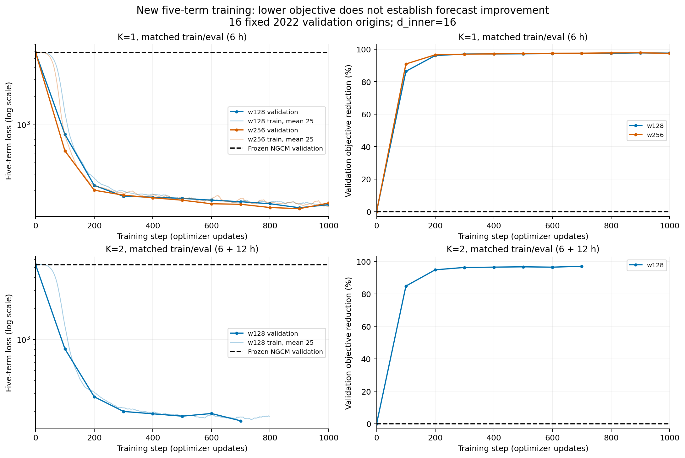
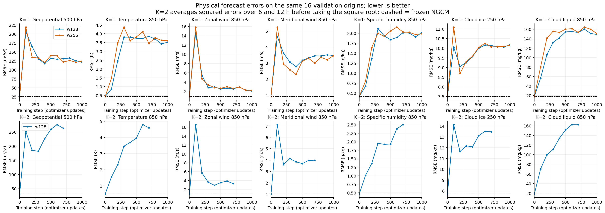
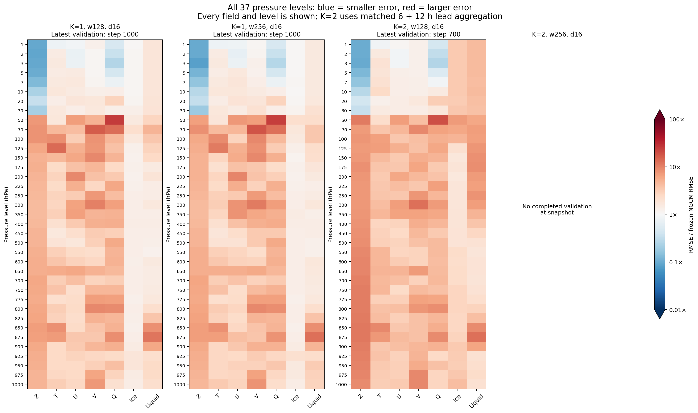

# NeuralGCM residual: new five-term training results

These figures replace the morning overview. They show models **actually trained
with the new five-term objective**, rather than older models rescored with a new
formula. All training curves use **optimizer update count** on the horizontal axis.

**Current result:** the validation objective drops sharply, but most field/pressure
pairs have larger physical RMSE. The large loss reduction must not be reported
as a comparable improvement in weather forecasting skill.

**Upper-level improvements:** [new physical-time figures](upper_air_physical_time_20260924/README.md)
show lower geopotential RMSE at every 1–30 hPa level for both widths and all K1/K2
forecast leads in the 12-origin window, alongside worse 500 hPa results.
[The cause analysis](upper_air_physical_time_20260924/ANALYSIS.md) separates removal
of a large spatial-mean bias from remaining spatial errors and explains how this
dominates the current aggregate objective. Seven headline-level degradations do
not imply that every variable at every level worsened.

**Physical quantities versus physical time:** the new [K=1/K=2 dated forecast
comparison](paper_physical_time_20260924/README.md) evaluates all four completed
1000-update stages using their best validation checkpoints. It separates +6 h
and +12 h forecasts and shows seven variables, global means, and New York/Beijing
point values against ERA5 and the frozen baseline. Its horizontal axis is forecast
valid time, as requested; the training curves below retain optimizer updates.

Snapshot: **2026-09-24T20:11:35.135269+00:00**. Both K=1 runs reached their 1000-update review
milestone. Other runs are shown only through their available validation points.
Missing results are not extrapolated. All configurations use d_inner=16.

| Matched train/eval K | Width | Last validation step | Frozen NGCM loss | Residual loss | Objective reduction |
| --- | --- | --- | --- | --- | --- |
| 1 | 128 | 1000 | 5808.064 | 142.437 | 97.55% |
| 1 | 256 | 1000 | 5808.064 | 148.071 | 97.45% |
| 2 | 128 | 700 | 5341.049 | 162.187 | 96.96% |
| 2 | 256 | No completed validation | — | — | — |

## Training and validation



Solid curves show validation every 100 updates, including the zero-residual
baseline at step 0. Faint curves are trailing 25-update means of training loss,
using changing training minibatches. Dashed lines are the frozen baseline on
the fixed validation set. The percentage is `100 * (1 - loss / baseline_loss)`.
It measures reduction of this objective, not a physical RMSE percentage.

[PDF](paper_training_20260924/objective_by_training_step.pdf) ·
[SVG](paper_training_20260924/objective_by_training_step.svg) ·
[Exact five-term validation contributions](paper_training_20260924/loss_terms_by_training_step.png) ·
[Seven training-field contributions](paper_training_20260924/training_field_contributions.png)

The training-field panels use the recorded, weighted data MSE + data spectrum +
bias for each variable. Native model-space contributions are additional. These
are training minibatch contributions, not per-field validation values.

## Physical errors on the same validation forecasts



All seven fields are shown at the labeled levels in physical units. Lower is
better. Dashed lines are matched frozen NGCM errors. K=1 scores +6 h. K=2 scores
+6 and +12 h, averaging their squared errors before taking the square root.
The CSV additionally retains each lead and all 37 levels separately.

For K=1 / w128 at **step 1000**, on the same 16 origins:

| Field and level | Frozen NGCM RMSE | Residual RMSE | Unit |
| --- | --- | --- | --- |
| geopotential, 500 hPa | 25.591 | 121.907 | m²/s² |
| temperature, 850 hPa | 0.436 | 3.512 | K |
| u_component_of_wind, 850 hPa | 0.862 | 2.092 | m/s |
| v_component_of_wind, 850 hPa | 0.919 | 3.464 | m/s |



Blue means lower RMSE than baseline; red means higher RMSE. All levels and fields
are included. These are ratios, not absolute errors, and colors saturate below
0.01× and above 100×. For both K=1 models, geopotential improves at **8 of 37**
levels, all at 1–30 hPa. Temperature improves at 1/37, zonal wind at 3/37,
humidity at 5/37, and meridional wind and both cloud species at 0/37 levels.
These counts use the 1000-update checkpoints, not the minimum-loss checkpoint.

## What matches the paper, and what remains approximate

The implementation follows the five-term construction and coefficients in
[NeuralGCM, Supplementary Information G.3–G.4](https://media.springernature.com/original/springer-static/esm/art%3A10.1038%2Fs41586-024-07744-y/MediaObjects/41586_2024_7744_MOESM1_ESM.pdf):

```text
L = 20 M_data + M_model + 0.1 M_data_spectrum + 0.1 M_model_spectrum + 2 M_bias
```

Variables are divided by training-only 24 h difference standard deviations from
60 snapshots. Samples, grid points and levels are pooled, except specific
humidity, which retains per-level scales. Additional amplitudes are geopotential
2, humidity 0.66, cloud species 0.05 and native log surface pressure 5, applied
before squaring. Lead-time amplitude factors follow G.3. These choices do not
guarantee equal contributions for a different initial model and training regime.

**This remains a documented reconstruction, not an exact reproduction of the
original training objective or evaluation protocol.** We did not find the full
original training-loss filter bindings in the public inference checkpoint and
reference code. The inference checkpoint alone does not establish those bindings.

| Component | This experiment | Paper alignment boundary |
| --- | --- | --- |
| Accuracy filter | `exp(-log(2) * (l / 120)^24)`, same for both spaces, variables and leads | Retains order 12 but fixes half-amplitude wavenumber 120; almost identity at l ≤ 64. The paper fits variable/lead-dependent attenuation using HRES/ERA5 errors. Those fitted parameters have not been reproduced. |
| Field/level reduction | All seven decoded fields, all 37 pressure levels, uniform level mean, field sum | Explicit experiment choice; full original selection and weighting bindings have not been verified. |
| Bias | Squared batch/time mean of modal-amplitude differences | Follows public `BatchMeanSquaredBias` default `abs(modal)`; original bindings have not been established. |
| Native scales | Linear pressure-to-sigma conversion with auxiliary orography | Omits learned orography perturbation for the scale statistics. Native targets use the frozen learned encoder. |
| Trainable parameters | Residual Mamba only; NGCM encoder, physics and decoder frozen | Differs from original end-to-end training and subsequent decoder fine-tuning. |
| Rollout | Fixed K=1 or K=2 with matched evaluation K | Original lead-time curriculum is not reproduced. |

Training retains its current configuration. No loss weights or filters were
changed for these plots. Existing numerical settings are recorded in the
[published snapshot](paper_training_20260924/snapshot.json), including source
hashes, statistics, origins and per-run objective metadata.

## Is this the paper's 2.8° baseline evaluation?

**The baseline model is the official pretrained deterministic 2.8° checkpoint.
The evaluation protocol is our paired short-lead validation, not the paper's
reported benchmark.** Its SHA256 is
`bdec1b4612c7385fc492aa031db252c66fb74b788a7efbb118b8b60b06644d3e`.
The residual branch starts with a zero output head; step 0 is the frozen model.

- Training years are 2015–2021. Evaluation here uses **16 fixed origins from 2022**.
  This is neither full-year validation nor the held-out 2023 test.
- Baseline and residual use the same ERA5 targets, regridded Gaussian grid,
  37 pressure levels, forcing policy, initialization times and forecast leads.
- Each origin starts from the official encoder and zero residual memory. Memory
  persists within the K-step forecast. There is no transfer between validation origins.
- K=1 includes +6 h; K=2 includes +6 and +12 h. Absolute losses from different K
  are not a controlled comparison at one common forecast horizon.
- Physical RMSE uses Gaussian area weighting, with errors formed in float64.
  Model execution remains FP32. Model selection uses the five-term validation loss.

No claim of statistical significance or reproduction of the paper's published
2.8° forecast scores follows from this small validation set.

## Why geopotential still dominates the initial loss

The 24 h standard deviation measures variability, not the current baseline's
forecast error. The pooled geopotential scale is **755.142 m²/s²**. The baseline
6 h geopotential RMSE is **30,017.113 m²/s² at 1 hPa**, compared with **25.591 m²/s²
at 500 hPa**. Squaring the normalized errors gives the few upper levels enormous
contributions, despite using the paper's rescaling recipe.

An independent diagnostic reconstructed from physical RMSE applies the same
amplitudes, time weights and uniform levels as `20 M_data`, but omits modal
projection and filtering. In this **unfiltered nodal diagnostic**, geopotential
contributes **97.93%** of baseline K=1 data error, almost all at 1–30 hPa.
After w128 reaches 1000 updates, its share is **38.24%**.
These are not shares of the full five-term objective or measured gradient shares.
The baseline diagnostic totals 5257.888, versus the exact logged modal
`20 M_data` of 5254.410; projection/filtering account for their differing definitions.

The arithmetic explains how the loss can fall while most levels worsen. It does
not establish the source of the baseline's large upper-atmosphere error, nor
prove that the filter approximation causes it. A dedicated encode/decode and
upper-level diagnostic would be needed to establish that cause.

## Data and reproduction

[Validation losses and all five terms](paper_training_20260924/validation_by_step.csv) ·
[Every field, pressure level and lead](paper_training_20260924/physical_rmse_by_step.csv) ·
[Diagnostic summary](paper_training_20260924/summary.json) ·
[Portable log snapshot and source hashes](paper_training_20260924/snapshot.json) ·
[Plotting script](plot_paper_training.py)

```bash
# Reproduce the published figures from their saved inputs, without a GPU.
python3 plot/plot_paper_training.py
# Explicitly refresh from local live logs before making a later report.
python3 plot/plot_paper_training.py --refresh
```

The export checks matched K, 16 origins, 37 levels, finite RMSE, increasing update
counts, term/field sums against logged loss, and identical baselines across widths.
Figures are available as PNG, PDF and SVG. Curves are not extrapolated beyond
completed validation; intervening checkpoints were not independently replayed.

## Historical material

The morning v2 and rescoring figures describe older training and are superseded
as the current overview. They remain only as explicitly marked historical audits:
[three old scoring definitions](loss_definitions_20260924/README.md),
[old physical evaluation](k1_physical_eval_20260924/README.md), and
[old normalization audit](loss_alignment_audit_20260924/README.md).
The previous claim that a large aggregate loss reduction established a broad
forecasting improvement is withdrawn.
