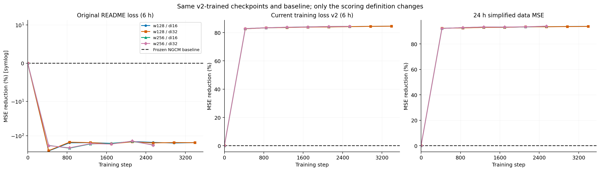
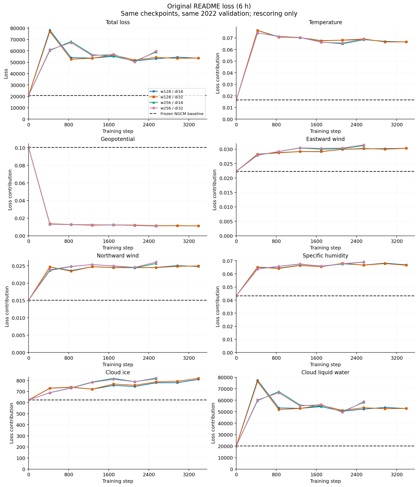
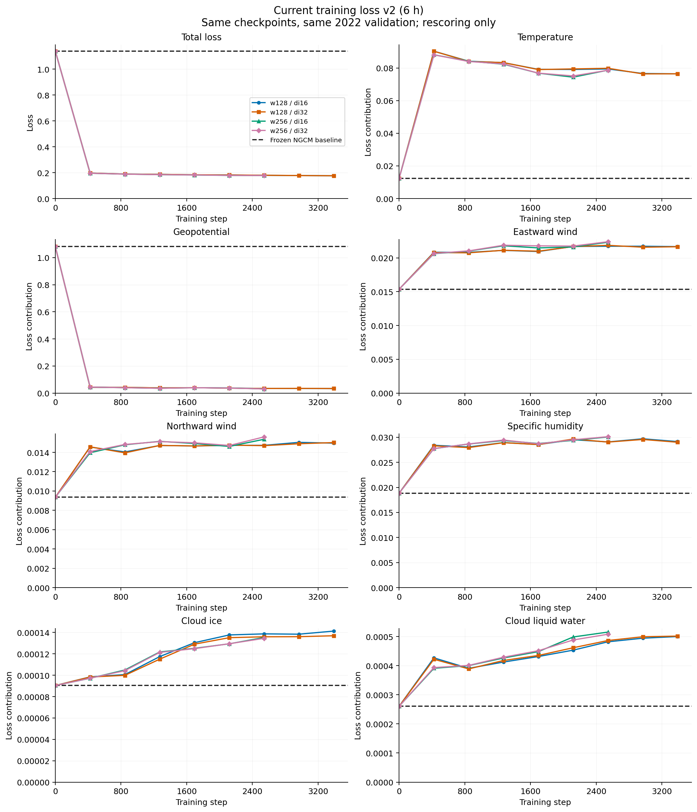
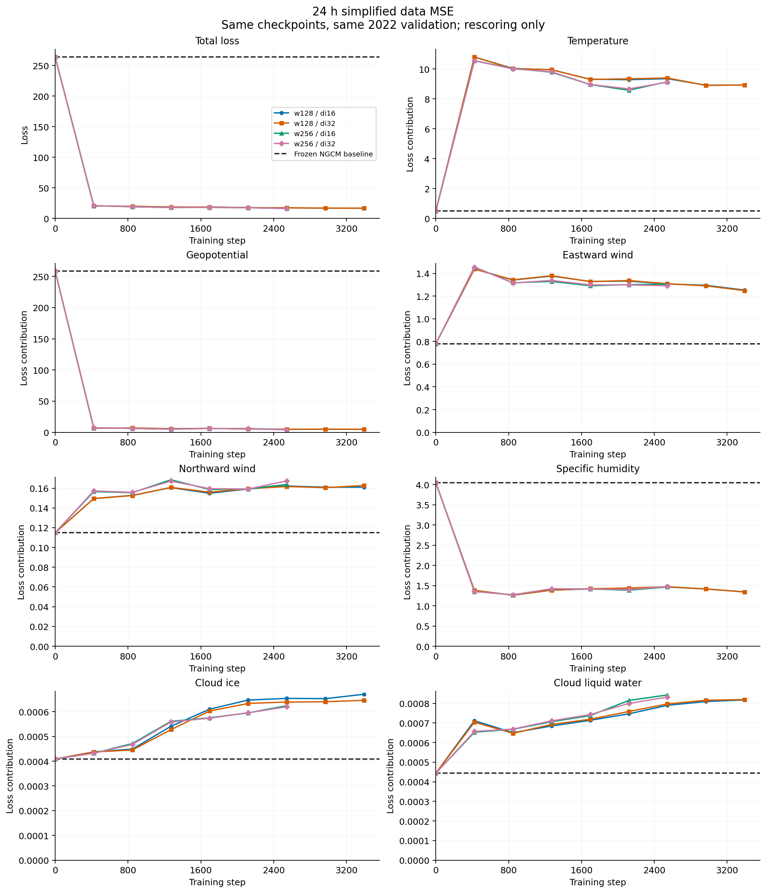

> **Historical, superseded as the current overview.** These results use older
> checkpoints/scoring definitions, not the current five-term training.
> See the [current results and evaluation limits](../README.md).

# Three loss definitions on the same training checkpoints

**All models here were trained with the current 6 h v2 objective.**
The original README and 24 h panels rescore those same checkpoints.
They are not separate training runs and are not paper-loss reproductions.

Every curve uses **training step (optimizer updates)** on the horizontal axis.
Every checkpoint is evaluated on the same **1,455 K=1, six-hour forecasts**
from the 2022 validation set. Each origin uses ERA5 physical initialization;
recurrent memory follows the chronological production validation policy.
The black dashed line is the frozen NGCM baseline under that panel's metric.
Colored curves distinguish the four residual configurations.



Loss is lower-is-better. Improvement is `100 × (1 − ours / baseline)`;
negative values mean worse than baseline. Loss magnitudes between different
definitions are not directly comparable. Each variable panel is its contribution
to the total across all 37 pressure levels, so the seven contributions sum to
total loss. Very large ranges are explicitly labeled log or symlog.

| Definition | Normalization | Vertical / field reduction | Status |
| --- | --- | --- | --- |
| Original README | Per-level 6 h change standard deviations and original floors; no extra variable amplitudes | Pressure-proportional levels; average seven fields | Initial project recipe |
| Current v2 | RMS-pooled 6 h scales except humidity; amplitudes Z=2, Q=0.66, clouds=0.05 | Pressure-proportional levels; average seven fields | Actual objective used to train these checkpoints |
| 24 h simplified MSE | Pooled 24 h standard deviations except per-level humidity; same amplitudes | Equal-level mean, field sum, six-hour lead-time factor 0.8 on squared errors | Offline candidate; omits filtering, internal-state, spectral and bias losses |

The 24 h scales use 60 fixed training-only snapshots in 2015–2021, with
uniform latitude weighting for fitting statistics; scoring uses Gaussian area
weights. The equal-level and field-sum reductions follow the official reference
defaults. Exact paper loss bindings, pressure masks and original statistical
samples have not been reproduced. The common paper data-term multiplier 20
is omitted, which does not affect improvements or shares.

The 24 h candidate also changes the vertical and field reductions; this is
not an ablation of only the normalization interval. The separate sensitivity
audit contains a matched-snapshot 6 h / 24 h comparison with fixed reductions.

[Paper G.3–G.4](https://arxiv.org/pdf/2311.07222#page=41) ·
[Official reference reducers](https://github.com/neuralgcm/neuralgcm/blob/main/neuralgcm/reference_code/metrics_base.py) ·
[Statistics and weighting sensitivity audit](../loss_alignment_audit_20260924/README.md)

## Latest evaluated checkpoints

| Configuration | Epoch | Training step | Replay job |
| --- | ---: | ---: | --- |
| r2p8_w128_di16 | 8 | 3,392 | 14367805 |
| r2p8_w128_di32 | 8 | 3,392 | 14367806 |
| r2p8_w256_di16 | 6 | 2,544 | 14367808 |
| r2p8_w256_di32 | 6 | 2,544 | 14367814 |

The epoch checkpoint set was frozen before replay. Each replay reproduced
the original v2 validation score at every checkpoint, checked the zero-residual
initialization against baseline, and independently checked physical MSE and
production recurrent-memory updates. An independent representative-data GPU
smoke preceded complete replays. All these GPU jobs use `gpu-test` / `gputest`
with time limits at or below one hour.

## Original README loss (6 h)



[Improvement curves](readme_v1/improvement_by_training_step.png) ·
[PDF](readme_v1/loss_by_training_step.pdf) · [SVG](readme_v1/loss_by_training_step.svg)

| Variable | Individual loss curve |
| --- | --- |
| Total loss | [PNG](readme_v1/total_loss.png) · [PDF](readme_v1/total_loss.pdf) · [SVG](readme_v1/total_loss.svg) |
| Temperature | [PNG](readme_v1/temperature_loss.png) · [PDF](readme_v1/temperature_loss.pdf) · [SVG](readme_v1/temperature_loss.svg) |
| Geopotential | [PNG](readme_v1/geopotential_loss.png) · [PDF](readme_v1/geopotential_loss.pdf) · [SVG](readme_v1/geopotential_loss.svg) |
| Eastward wind | [PNG](readme_v1/u_component_of_wind_loss.png) · [PDF](readme_v1/u_component_of_wind_loss.pdf) · [SVG](readme_v1/u_component_of_wind_loss.svg) |
| Northward wind | [PNG](readme_v1/v_component_of_wind_loss.png) · [PDF](readme_v1/v_component_of_wind_loss.pdf) · [SVG](readme_v1/v_component_of_wind_loss.svg) |
| Specific humidity | [PNG](readme_v1/specific_humidity_loss.png) · [PDF](readme_v1/specific_humidity_loss.pdf) · [SVG](readme_v1/specific_humidity_loss.svg) |
| Cloud ice | [PNG](readme_v1/specific_cloud_ice_water_content_loss.png) · [PDF](readme_v1/specific_cloud_ice_water_content_loss.pdf) · [SVG](readme_v1/specific_cloud_ice_water_content_loss.svg) |
| Cloud liquid water | [PNG](readme_v1/specific_cloud_liquid_water_content_loss.png) · [PDF](readme_v1/specific_cloud_liquid_water_content_loss.pdf) · [SVG](readme_v1/specific_cloud_liquid_water_content_loss.svg) |

| Configuration | Baseline total loss | Residual total loss | Reduction | Baseline geopotential share |
| --- | ---: | ---: | ---: | ---: |
| r2p8_w128_di16 | 20832.4 | 53555.4 | -157.08% | 0.00048% |
| r2p8_w128_di32 | 20832.4 | 53672.7 | -157.64% | 0.00048% |
| r2p8_w256_di16 | 20832.4 | 58986.6 | -183.15% | 0.00048% |
| r2p8_w256_di32 | 20832.4 | 59611.2 | -186.15% | 0.00048% |

## Current training loss v2 (6 h)



[Improvement curves](current_v2/improvement_by_training_step.png) ·
[PDF](current_v2/loss_by_training_step.pdf) · [SVG](current_v2/loss_by_training_step.svg)

| Variable | Individual loss curve |
| --- | --- |
| Total loss | [PNG](current_v2/total_loss.png) · [PDF](current_v2/total_loss.pdf) · [SVG](current_v2/total_loss.svg) |
| Temperature | [PNG](current_v2/temperature_loss.png) · [PDF](current_v2/temperature_loss.pdf) · [SVG](current_v2/temperature_loss.svg) |
| Geopotential | [PNG](current_v2/geopotential_loss.png) · [PDF](current_v2/geopotential_loss.pdf) · [SVG](current_v2/geopotential_loss.svg) |
| Eastward wind | [PNG](current_v2/u_component_of_wind_loss.png) · [PDF](current_v2/u_component_of_wind_loss.pdf) · [SVG](current_v2/u_component_of_wind_loss.svg) |
| Northward wind | [PNG](current_v2/v_component_of_wind_loss.png) · [PDF](current_v2/v_component_of_wind_loss.pdf) · [SVG](current_v2/v_component_of_wind_loss.svg) |
| Specific humidity | [PNG](current_v2/specific_humidity_loss.png) · [PDF](current_v2/specific_humidity_loss.pdf) · [SVG](current_v2/specific_humidity_loss.svg) |
| Cloud ice | [PNG](current_v2/specific_cloud_ice_water_content_loss.png) · [PDF](current_v2/specific_cloud_ice_water_content_loss.pdf) · [SVG](current_v2/specific_cloud_ice_water_content_loss.svg) |
| Cloud liquid water | [PNG](current_v2/specific_cloud_liquid_water_content_loss.png) · [PDF](current_v2/specific_cloud_liquid_water_content_loss.pdf) · [SVG](current_v2/specific_cloud_liquid_water_content_loss.svg) |

| Configuration | Baseline total loss | Residual total loss | Reduction | Baseline geopotential share |
| --- | ---: | ---: | ---: | ---: |
| r2p8_w128_di16 | 1.13895 | 0.176218 | 84.53% | 95.06% |
| r2p8_w128_di32 | 1.13895 | 0.176395 | 84.51% | 95.06% |
| r2p8_w256_di16 | 1.13895 | 0.177641 | 84.40% | 95.06% |
| r2p8_w256_di32 | 1.13895 | 0.177997 | 84.37% | 95.06% |

## 24 h simplified data MSE



[Improvement curves](normalized24_mse/improvement_by_training_step.png) ·
[PDF](normalized24_mse/loss_by_training_step.pdf) · [SVG](normalized24_mse/loss_by_training_step.svg)

| Variable | Individual loss curve |
| --- | --- |
| Total loss | [PNG](normalized24_mse/total_loss.png) · [PDF](normalized24_mse/total_loss.pdf) · [SVG](normalized24_mse/total_loss.svg) |
| Temperature | [PNG](normalized24_mse/temperature_loss.png) · [PDF](normalized24_mse/temperature_loss.pdf) · [SVG](normalized24_mse/temperature_loss.svg) |
| Geopotential | [PNG](normalized24_mse/geopotential_loss.png) · [PDF](normalized24_mse/geopotential_loss.pdf) · [SVG](normalized24_mse/geopotential_loss.svg) |
| Eastward wind | [PNG](normalized24_mse/u_component_of_wind_loss.png) · [PDF](normalized24_mse/u_component_of_wind_loss.pdf) · [SVG](normalized24_mse/u_component_of_wind_loss.svg) |
| Northward wind | [PNG](normalized24_mse/v_component_of_wind_loss.png) · [PDF](normalized24_mse/v_component_of_wind_loss.pdf) · [SVG](normalized24_mse/v_component_of_wind_loss.svg) |
| Specific humidity | [PNG](normalized24_mse/specific_humidity_loss.png) · [PDF](normalized24_mse/specific_humidity_loss.pdf) · [SVG](normalized24_mse/specific_humidity_loss.svg) |
| Cloud ice | [PNG](normalized24_mse/specific_cloud_ice_water_content_loss.png) · [PDF](normalized24_mse/specific_cloud_ice_water_content_loss.pdf) · [SVG](normalized24_mse/specific_cloud_ice_water_content_loss.svg) |
| Cloud liquid water | [PNG](normalized24_mse/specific_cloud_liquid_water_content_loss.png) · [PDF](normalized24_mse/specific_cloud_liquid_water_content_loss.pdf) · [SVG](normalized24_mse/specific_cloud_liquid_water_content_loss.svg) |

| Configuration | Baseline total loss | Residual total loss | Reduction | Baseline geopotential share |
| --- | ---: | ---: | ---: | ---: |
| r2p8_w128_di16 | 263.943 | 16.5298 | 93.74% | 97.94% |
| r2p8_w128_di32 | 263.943 | 16.5921 | 93.71% | 97.94% |
| r2p8_w256_di16 | 263.943 | 16.0812 | 93.91% | 97.94% |
| r2p8_w256_di32 | 263.943 | 16.0511 | 93.92% | 97.94% |

## Interpretation and provenance

The README recipe is explicitly a custom decoded loss, as stated in
[section 9 of the original project plan](../../docs/experiments/neuralgcm_residual/README.md#9-objective-validation-and-final-report).
The v2 restart subsequently pooled scales and added amplitudes. Simply replacing
6 h scales with 24 h scales does not eliminate geopotential dominance; the
normalization audit shows this independently of any new training.
No normalization change alters the underlying physical RMSE. These charts
must be read alongside the [physical-variable evaluation](../k1_physical_eval_20260924/README.md).

[Exact formulas, README differences, diagnosed problems and proposed design](../LOSS_DEFINITION_AND_DESIGN.md)

[Loss-curve CSV](loss_curves.csv) · [Per-level physical MSE by step](physical_mse_by_step.csv) ·
[Checkpoints, coefficients, statistics and replay reports](provenance.json)

Redraw from portable committed CSV files:

```bash
python plot/plot_loss_definitions.py
```

Refresh after completed full replays:

```bash
python plot/plot_loss_definitions.py --results-root logs/neuralgcm_loss_curves_20260924
```
