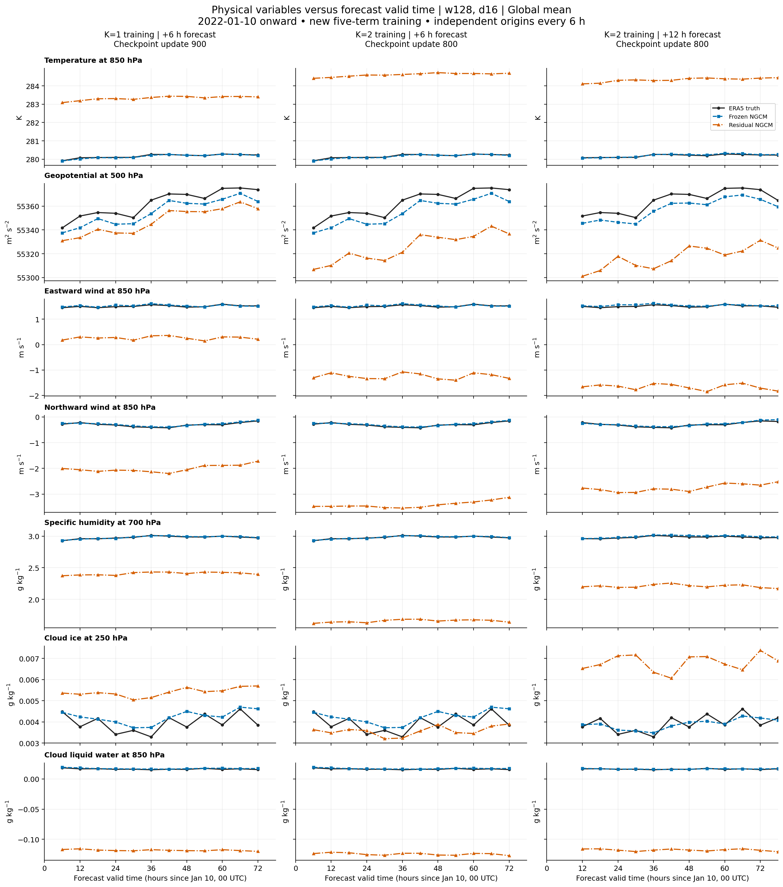

# K=1/K=2 physical variables versus physical time

These figures use the new five-term training checkpoints. The horizontal axis is
**forecast valid time**, measured in hours since **2022-01-10 00 UTC**.
Each panel shows ERA5 truth, the official frozen deterministic 2.8° NeuralGCM,
and the residual model in physical units.



The columns separate K=1 at +6 h, K=2 at +6 h, and K=2 at +12 h.
There are 12 common origins, one every 6 h from January 10 00 UTC.
The last +12 h forecast is valid on January 13 at 06 UTC (offset 78 h).
State and residual memory reset at each origin. Within K=2, the corrected
first forecast feeds the second step without replacing it with ERA5.
**These are successive short forecasts, not a single 72-hour free-running forecast.**

The seven standard variable/level pairs were declared before evaluation. All
37 levels remain available in the CSV files. Global means can hide local
errors, so New York and Beijing nearest-grid-point curves are also provided.
Cloud and humidity plots use g/kg; CSV values retain kg/kg. Geopotential
is m²/s², not geopotential height. Outputs are shown without clipping,
including negative residual cloud-water predictions.

| Width | Global | New York | Beijing |
| --- | --- | --- | --- |
| 128 | [Figure](w128_global.png) | [Figure](w128_new_york.png) | [Figure](w128_beijing.png) |
| 256 | [Figure](w256_global.png) | [Figure](w256_new_york.png) | [Figure](w256_beijing.png) |

## Checkpoints and scoring

Best validation loss within each completed 1000-update stage, selected before physical-window evaluation.

| Configuration | Selected update | Completed stage |
| --- | ---: | ---: |
| k1_w128_d16 | 900 | 1000 |
| k1_w256_d16 | 900 | 1000 |
| k2_w128_d16 | 800 | 1000 |
| k2_w256_d16 | 900 | 1000 |

### Window gridpoint RMSE, w128

| Variable | Unit | Baseline +6 h | K1 +6 h | K2 +6 h | Baseline +12 h | K2 +12 h |
| --- | --- | ---: | ---: | ---: | ---: | ---: |
| T850 | K | 0.4705 | 3.464 | 5.056 | 0.5357 | 4.792 |
| Z500 | m²/s² | 31.14 | 125.6 | 148.3 | 36.52 | 291.9 |
| U850 | m/s | 0.9505 | 2.206 | 3.588 | 1.067 | 4.545 |
| V850 | m/s | 1.007 | 3.404 | 4.082 | 1.125 | 4.886 |
| Q700 | g/kg | 0.3706 | 1.11 | 1.766 | 0.4285 | 1.471 |
| CI250 | g/kg | 0.007387 | 0.009155 | 0.009181 | 0.008431 | 0.01688 |
| CL850 | g/kg | 0.01685 | 0.1482 | 0.1541 | 0.01729 | 0.1511 |

### Window gridpoint RMSE, w256

| Variable | Unit | Baseline +6 h | K1 +6 h | K2 +6 h | Baseline +12 h | K2 +12 h |
| --- | --- | ---: | ---: | ---: | ---: | ---: |
| T850 | K | 0.4705 | 3.692 | 4.782 | 0.5357 | 4.389 |
| Z500 | m²/s² | 31.14 | 122.6 | 125.5 | 36.52 | 314.8 |
| U850 | m/s | 0.9505 | 2.146 | 2.759 | 1.067 | 3.876 |
| V850 | m/s | 1.007 | 3.101 | 4.271 | 1.125 | 3.671 |
| Q700 | g/kg | 0.3706 | 1.101 | 1.059 | 0.4285 | 0.9999 |
| CI250 | g/kg | 0.007387 | 0.009063 | 0.008925 | 0.008431 | 0.0133 |
| CL850 | g/kg | 0.01685 | 0.157 | 0.1236 | 0.01729 | 0.1254 |

Every forecast uses the same data grid, forcing policy, verification targets
and frozen backbone as training. Separate +6/+12 h errors must not be
treated as scores at one common horizon. Window RMSE is computed from
gridpoint squared errors before spatial/time averaging and square root;
it is not the error of the plotted global-mean curves. This three-day
illustration is not full-year evaluation or the paper benchmark.

The evaluation checks zero-residual equality with the official baseline,
agreement with the production physical evaluator on two origins, unchanged
backbone parameters, all expected fields/levels/leads, finite values, exact
checkpoint/source hashes, and equal paired baselines across configurations.

[Time series](timeseries.csv) · [Per-origin gridpoint errors](physical_errors.csv) ·
[Window RMSE by variable, level and lead](physical_rmse.csv) · [Provenance](provenance.json)

PNG, PDF and editable SVG files are provided for every figure.

```bash
python3 plot/plot_paper_physical_time.py
```

[Training-step curves and loss/evaluation limitations](../README.md)
