> **Historical, superseded as the current overview.** These results use older
> checkpoints/scoring definitions, not the current five-term training.
> See the [current results and evaluation limits](../README.md).

# Upper-air physical variables with improved RMSE

**Geopotential improves at 1, 2, 3, 5, 7, 10, 20 and 30 hPa; specific
humidity improves at 1, 2, 3 and 5 hPa.** Both are displayed below.

Selection: these are all field/level pairs at **100 hPa or lower pressure**
with positive full-year physical RMSE improvement for w128/di16.
The same twelve pairs are shown for all four configurations, and all improve.
This is an explicitly selected view of favorable results, not an all-variable
skill summary. [Standard-level results and all-level errors](../k1_physical_eval_20260924/README.md)
remain available, including deteriorations.

## Physical time and evaluation meaning

Every panel compares **ERA5 truth (black), frozen NGCM (blue), and residual
NGCM (orange)** in physical units. The curves show global Gaussian-area
means from 2022-01-10 06 UTC through January 13 00 UTC. The x-axis is
elapsed **physical valid time**, at 6, 12, ..., 72 h from January 10 00 UTC.
Each point is a **six-hour K=1 forecast initialized from ERA5 at the preceding
origin**, with chronological recurrent memory. This is not a free-running
72-hour rollout. All displayed models were trained with the 6 h v2 loss.

The RMSE reductions use **all 1,455 six-hour 2022 validation forecasts**,
averaging squared errors over grid cells and dates before taking the square
root. They are not errors of the global-mean curves or scores from this
three-day window alone. Percentages here are **RMSE**, not MSE, reductions.

## Representative comparison: w128/di16, update 2,968

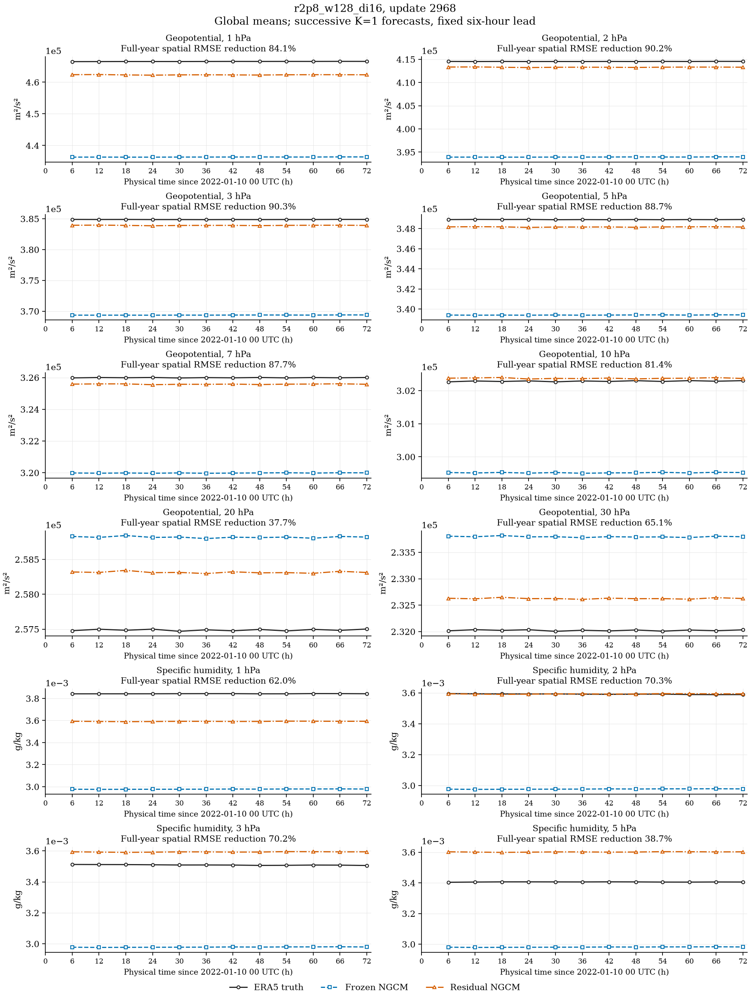

| Variable | Pressure (hPa) | Unit | Baseline RMSE | Residual RMSE | RMSE reduction |
| --- | ---: | --- | ---: | ---: | ---: |
| Geopotential | 1 | m²/s² | 30070.3 | 4770.43 | 84.14% |
| Geopotential | 2 | m²/s² | 20535.5 | 2021.87 | 90.15% |
| Geopotential | 3 | m²/s² | 15485.9 | 1499.61 | 90.32% |
| Geopotential | 5 | m²/s² | 9498.43 | 1072.88 | 88.70% |
| Geopotential | 7 | m²/s² | 5993.53 | 735.209 | 87.73% |
| Geopotential | 10 | m²/s² | 2748.21 | 511.395 | 81.39% |
| Geopotential | 20 | m²/s² | 1367.65 | 851.585 | 37.73% |
| Geopotential | 30 | m²/s² | 1771.89 | 617.533 | 65.15% |
| Specific humidity | 1 | g/kg | 0.000893292 | 0.000339033 | 62.05% |
| Specific humidity | 2 | g/kg | 0.000727384 | 0.000216338 | 70.26% |
| Specific humidity | 3 | g/kg | 0.000603557 | 0.000179724 | 70.22% |
| Specific humidity | 5 | g/kg | 0.000431435 | 0.000264374 | 38.72% |

## Individual physical-time comparisons

### Geopotential at 1 hPa (m²/s²)

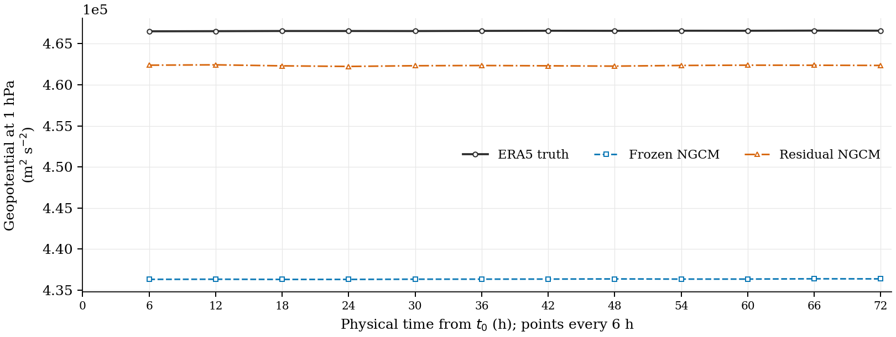

[PDF](../k1_physical_eval_20260924/r2p8_w128_di16/Z1_global_timeseries.pdf) · [SVG](../k1_physical_eval_20260924/r2p8_w128_di16/Z1_global_timeseries.svg)

### Geopotential at 2 hPa (m²/s²)

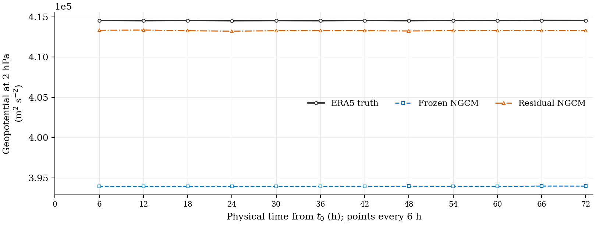

[PDF](../k1_physical_eval_20260924/r2p8_w128_di16/Z2_global_timeseries.pdf) · [SVG](../k1_physical_eval_20260924/r2p8_w128_di16/Z2_global_timeseries.svg)

### Geopotential at 3 hPa (m²/s²)

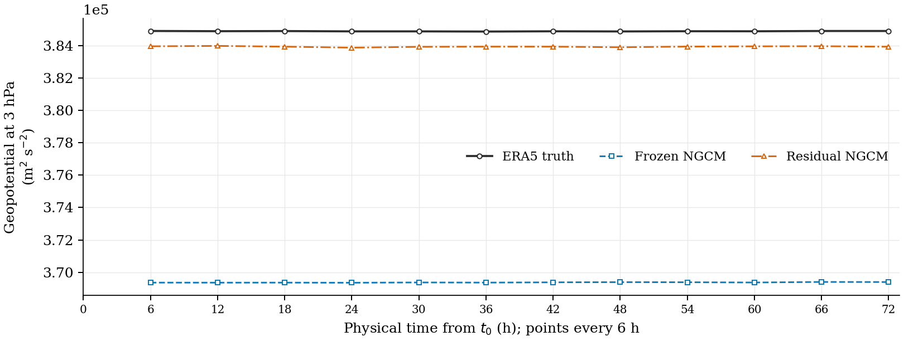

[PDF](../k1_physical_eval_20260924/r2p8_w128_di16/Z3_global_timeseries.pdf) · [SVG](../k1_physical_eval_20260924/r2p8_w128_di16/Z3_global_timeseries.svg)

### Geopotential at 5 hPa (m²/s²)

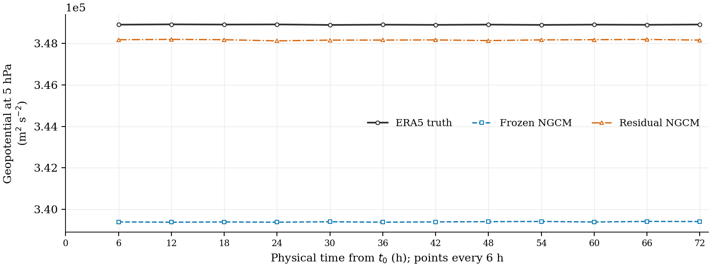

[PDF](../k1_physical_eval_20260924/r2p8_w128_di16/Z5_global_timeseries.pdf) · [SVG](../k1_physical_eval_20260924/r2p8_w128_di16/Z5_global_timeseries.svg)

### Geopotential at 7 hPa (m²/s²)

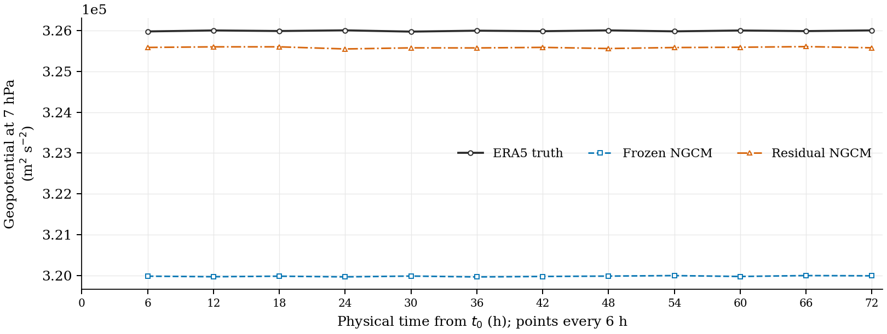

[PDF](../k1_physical_eval_20260924/r2p8_w128_di16/Z7_global_timeseries.pdf) · [SVG](../k1_physical_eval_20260924/r2p8_w128_di16/Z7_global_timeseries.svg)

### Geopotential at 10 hPa (m²/s²)

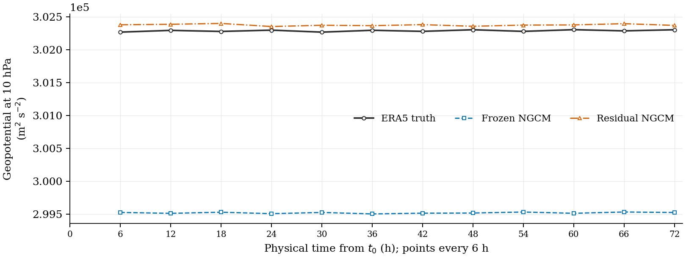

[PDF](../k1_physical_eval_20260924/r2p8_w128_di16/Z10_global_timeseries.pdf) · [SVG](../k1_physical_eval_20260924/r2p8_w128_di16/Z10_global_timeseries.svg)

### Geopotential at 20 hPa (m²/s²)

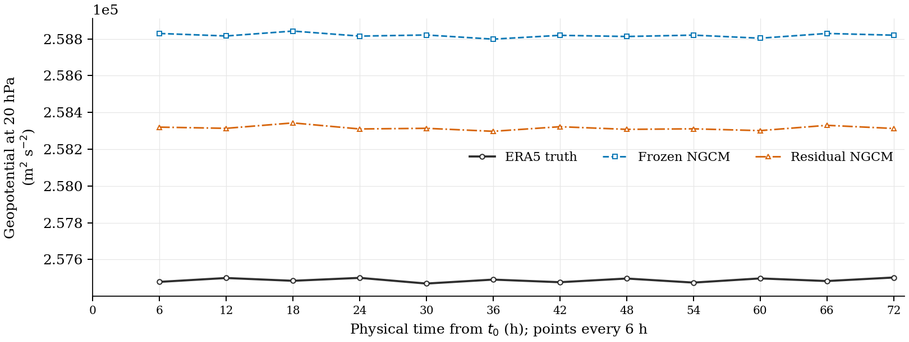

[PDF](../k1_physical_eval_20260924/r2p8_w128_di16/Z20_global_timeseries.pdf) · [SVG](../k1_physical_eval_20260924/r2p8_w128_di16/Z20_global_timeseries.svg)

### Geopotential at 30 hPa (m²/s²)

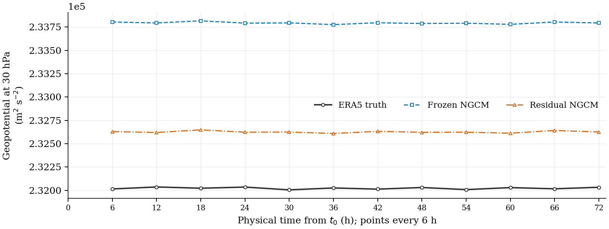

[PDF](../k1_physical_eval_20260924/r2p8_w128_di16/Z30_global_timeseries.pdf) · [SVG](../k1_physical_eval_20260924/r2p8_w128_di16/Z30_global_timeseries.svg)

### Specific humidity at 1 hPa (g/kg)

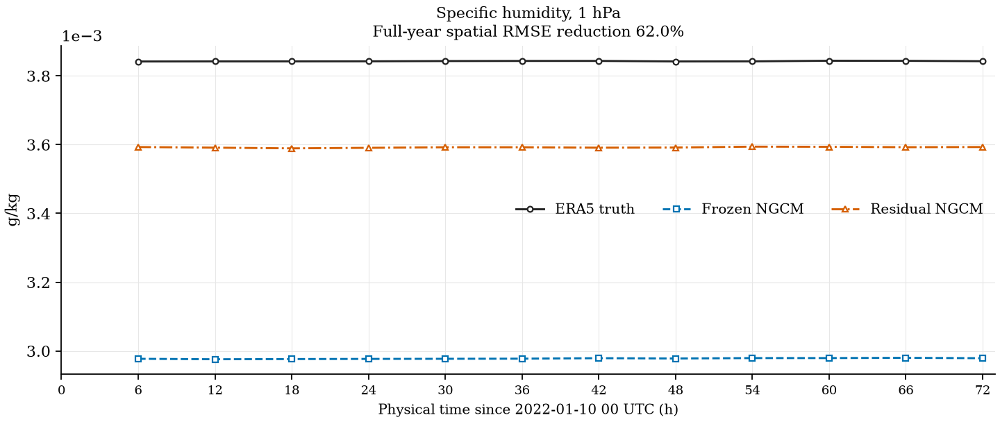

[PDF](r2p8_w128_di16/Q1_global_timeseries.pdf) · [SVG](r2p8_w128_di16/Q1_global_timeseries.svg)

### Specific humidity at 2 hPa (g/kg)

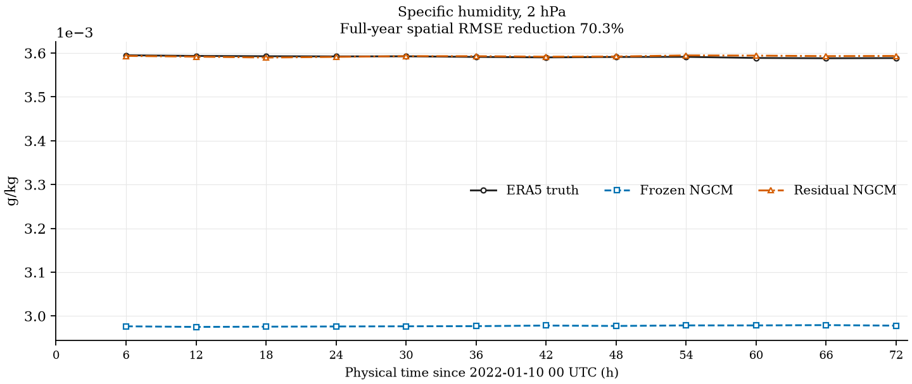

[PDF](r2p8_w128_di16/Q2_global_timeseries.pdf) · [SVG](r2p8_w128_di16/Q2_global_timeseries.svg)

### Specific humidity at 3 hPa (g/kg)

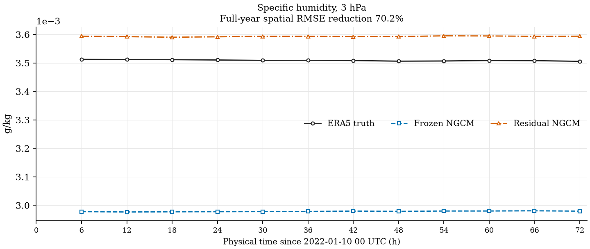

[PDF](r2p8_w128_di16/Q3_global_timeseries.pdf) · [SVG](r2p8_w128_di16/Q3_global_timeseries.svg)

### Specific humidity at 5 hPa (g/kg)

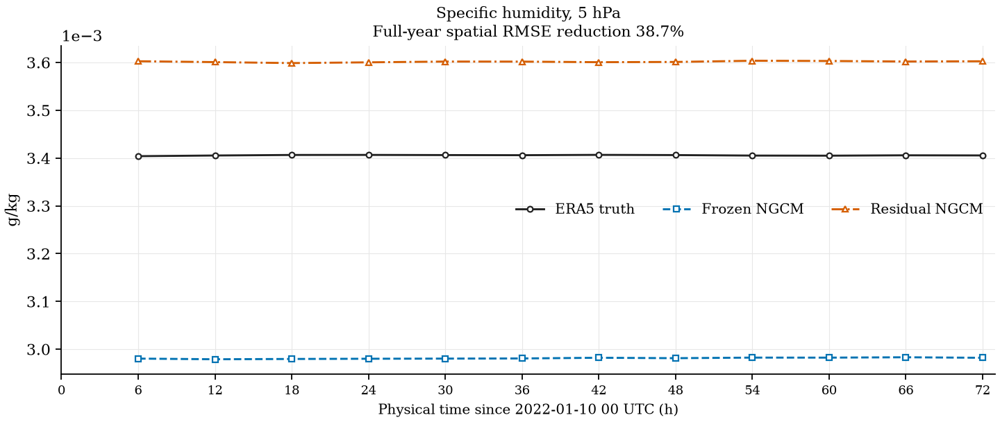

[PDF](r2p8_w128_di16/Q5_global_timeseries.pdf) · [SVG](r2p8_w128_di16/Q5_global_timeseries.svg)

## Four-configuration RMSE reductions

| Variable / pressure | w128_di16 | w128_di32 | w256_di16 | w256_di32 |
| --- | ---: | ---: | ---: | ---: |
| Z1 | 84.14% | 83.78% | 82.33% | 82.76% |
| Z2 | 90.15% | 89.89% | 88.71% | 89.07% |
| Z3 | 90.32% | 90.03% | 88.90% | 89.27% |
| Z5 | 88.70% | 88.42% | 87.37% | 87.77% |
| Z7 | 87.73% | 87.48% | 86.75% | 87.13% |
| Z10 | 81.39% | 81.39% | 81.10% | 81.05% |
| Z20 | 37.73% | 37.45% | 36.16% | 36.11% |
| Z30 | 65.15% | 64.79% | 63.55% | 63.85% |
| Q1 | 62.05% | 62.12% | 62.24% | 62.64% |
| Q2 | 70.26% | 70.31% | 70.26% | 70.57% |
| Q3 | 70.22% | 70.26% | 70.36% | 70.24% |
| Q5 | 38.72% | 38.74% | 39.20% | 38.29% |

The w128 checkpoints are at update 2,968; the w256 checkpoints are at
update 2,120. These comparisons do not imply matched training budgets.

### r2p8_w128_di16, update 2968

[PNG](r2p8_w128_di16/upper_air_improvements.png) · [PDF](r2p8_w128_di16/upper_air_improvements.pdf) · [SVG](r2p8_w128_di16/upper_air_improvements.svg)

### r2p8_w128_di32, update 2968

[PNG](r2p8_w128_di32/upper_air_improvements.png) · [PDF](r2p8_w128_di32/upper_air_improvements.pdf) · [SVG](r2p8_w128_di32/upper_air_improvements.svg)

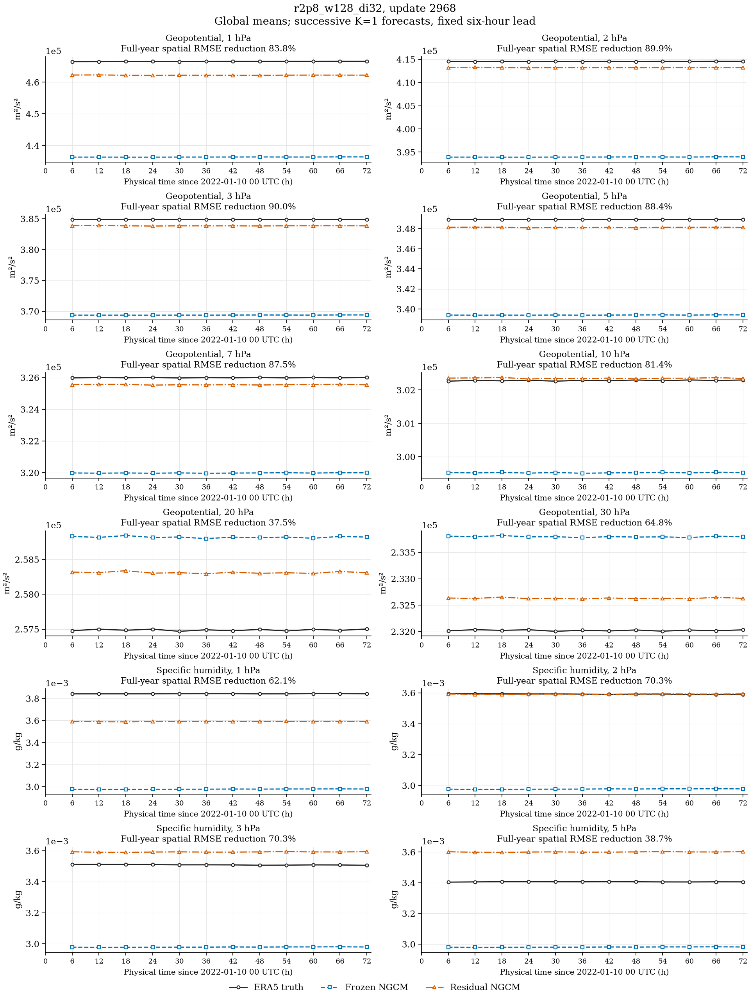

### r2p8_w256_di16, update 2120

[PNG](r2p8_w256_di16/upper_air_improvements.png) · [PDF](r2p8_w256_di16/upper_air_improvements.pdf) · [SVG](r2p8_w256_di16/upper_air_improvements.svg)

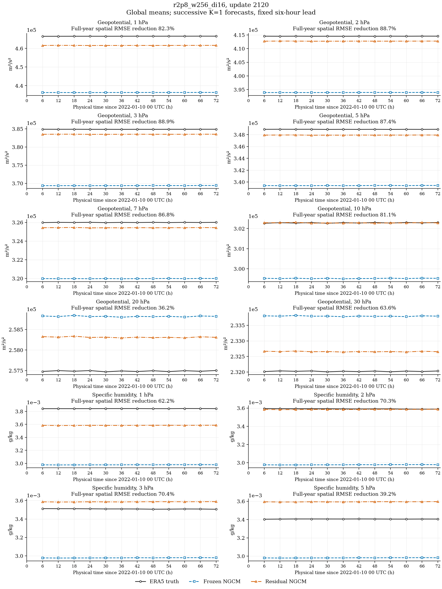

### r2p8_w256_di32, update 2120

[PNG](r2p8_w256_di32/upper_air_improvements.png) · [PDF](r2p8_w256_di32/upper_air_improvements.pdf) · [SVG](r2p8_w256_di32/upper_air_improvements.svg)

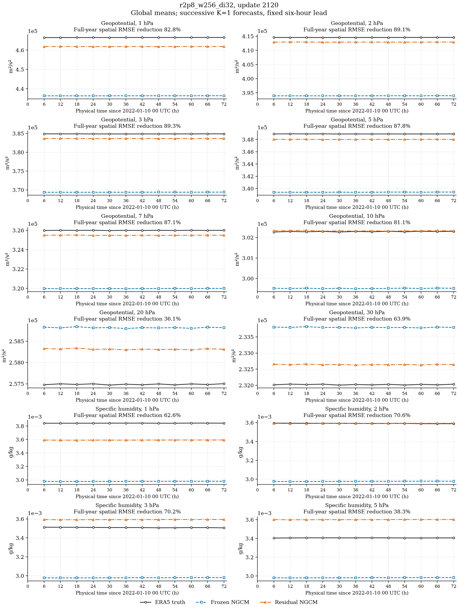

## Data and reproduction

[Physical-time CSV](timeseries.csv) · [Checkpoint and source hashes](provenance.json) ·
[All-variable, all-level physical metrics](../k1_physical_eval_20260924/physical_metrics_all_levels.csv)

The new humidity curves are exported from the existing verified full-year
evaluation arrays. No additional GPU evaluation or training was required.
The geopotential individual figures reuse the earlier published physical curves.

Redraw from committed CSV data:

```bash
python plot/plot_upper_air_physical.py
```

Refresh from the original evaluation artifacts:

```bash
python plot/plot_upper_air_physical.py --results-root logs/neuralgcm_physical_eval_20260924
```
