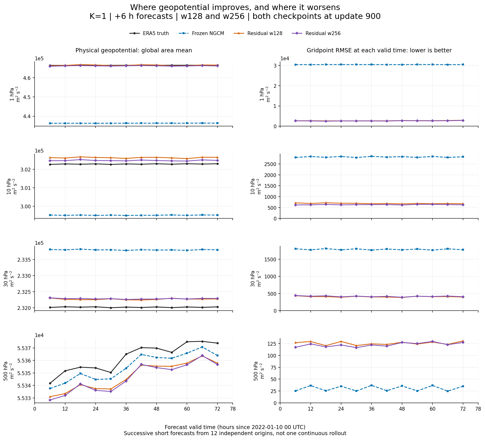

# Upper-air physical variables versus physical time

This report uses the same saved 12-origin paired evaluation as the earlier physical-time report.
It includes **all eight levels at 1, 2, 3, 5, 7, 10, 20 and 30 hPa**, plus 500 hPa geopotential for comparison.
The horizontal axis is **forecast valid time**, in hours since **2022-01-10 00 UTC**.



[Overview PDF](geopotential_overview.pdf) · [Editable SVG](geopotential_overview.svg) ·
**[中文分析：高层改善、偏差分解与 loss 下降原因](ANALYSIS.md)**

Left: physical geopotential, with ERA5 truth, frozen NeuralGCM and both residual widths.
Right: Gaussian-area gridpoint RMSE at each time, computed before spatial averaging.
RMSE is not the error of the plotted global mean. Raw values are not clipped or shifted.

## What the saved evaluation shows

Upper-level geopotential improves while 500 hPa geopotential worsens. The earlier seven headline
variable/level pairs did not include these upper levels. Their degradation does not mean that
every variable at every pressure level became worse.

| Level | Frozen +6 h | K1 w128 | K1 w256 | K2 w128 +6 h | K2 w256 +6 h | Frozen +12 h | K2 w128 +12 h | K2 w256 +12 h |
| --- | ---: | ---: | ---: | ---: | ---: | ---: | ---: | ---: |
| 1 hPa | 30,406.3 | 2,706.8 | 2,634.6 | 3,020.4 | 2,977.0 | 30,479.2 | 3,531.5 | 3,305.9 |
| 2 hPa | 20,741.7 | 1,733.3 | 1,678.0 | 1,985.6 | 1,776.5 | 20,797.0 | 2,407.9 | 2,076.9 |
| 3 hPa | 15,609.0 | 1,270.7 | 1,323.5 | 1,399.1 | 1,472.1 | 15,653.3 | 1,855.1 | 1,719.8 |
| 5 hPa | 9,579.3 | 968.9 | 918.6 | 1,028.2 | 980.9 | 9,606.7 | 1,383.4 | 1,252.4 |
| 7 hPa | 6,064.0 | 787.8 | 738.6 | 784.5 | 809.3 | 6,082.3 | 1,108.9 | 1,099.7 |
| 10 hPa | 2,819.5 | 688.5 | 631.7 | 595.2 | 648.2 | 2,828.9 | 909.2 | 1,009.3 |
| 20 hPa | 1,363.3 | 554.8 | 503.3 | 470.6 | 507.6 | 1,362.8 | 750.0 | 846.7 |
| 30 hPa | 1,788.3 | 408.2 | 417.4 | 498.7 | 473.9 | 1,794.2 | 796.7 | 853.2 |
| 500 hPa | 31.1 | 125.6 | 122.6 | 148.3 | 125.5 | 36.5 | 291.9 | 314.8 |

All table entries are window gridpoint RMSE in m²/s², lower is better.

## All upper-level time series

Each figure has one row per pressure level and three columns: K1/+6 h, K2/+6 h, K2/+12 h.
Black is ERA5, blue is frozen NGCM, orange is the residual model.

| Variable | w128 global mean | w256 global mean |
| --- | --- | --- |
| Geopotential | [Figure](w128_geopotential_global.png) | [Figure](w256_geopotential_global.png) |
| Temperature | [Figure](w128_temperature_global.png) | [Figure](w256_temperature_global.png) |
| Eastward wind | [Figure](w128_u_component_of_wind_global.png) | [Figure](w256_u_component_of_wind_global.png) |
| Northward wind | [Figure](w128_v_component_of_wind_global.png) | [Figure](w256_v_component_of_wind_global.png) |
| Specific humidity | [Figure](w128_specific_humidity_global.png) | [Figure](w256_specific_humidity_global.png) |
| Cloud ice | [Figure](w128_specific_cloud_ice_water_content_global.png) | [Figure](w256_specific_cloud_ice_water_content_global.png) |
| Cloud liquid water | [Figure](w128_specific_cloud_liquid_water_content_global.png) | [Figure](w256_specific_cloud_liquid_water_content_global.png) |

| Geopotential detail | w128 | w256 |
| --- | --- | --- |
| New York gridpoint | [Figure](w128_geopotential_new_york.png) | [Figure](w256_geopotential_new_york.png) |
| Beijing gridpoint | [Figure](w128_geopotential_beijing.png) | [Figure](w256_geopotential_beijing.png) |
| Global gridpoint RMSE over time | [Figure](w128_geopotential_rmse.png) | [Figure](w256_geopotential_rmse.png) |

Every figure is also available as PDF and editable SVG with the same filename stem.

## How many upper-level pairs improve?

Counts below are across the eight levels, using window gridpoint RMSE, not global means.

| Variable | K1 w128 +6 h | K1 w256 +6 h | K2 w128 +6 h | K2 w256 +6 h | K2 w128 +12 h | K2 w256 +12 h |
| --- | ---: | ---: | ---: | ---: | ---: | ---: |
| Geopotential | 8/8 | 8/8 | 8/8 | 8/8 | 8/8 | 8/8 |
| Temperature | 1/8 | 1/8 | 1/8 | 1/8 | 1/8 | 1/8 |
| Eastward wind | 0/8 | 1/8 | 0/8 | 1/8 | 0/8 | 1/8 |
| Northward wind | 0/8 | 0/8 | 0/8 | 0/8 | 0/8 | 0/8 |
| Specific humidity | 5/8 | 5/8 | 5/8 | 5/8 | 5/8 | 5/8 |
| Cloud ice | 0/8 | 0/8 | 0/8 | 0/8 | 0/8 | 0/8 |
| Cloud liquid water | 0/8 | 0/8 | 0/8 | 0/8 | 0/8 | 0/8 |

## Why the training objective can decay

This separate diagnostic uses **K1/w128 at the selected update 900 on its original 16 validation origins**.
It is not computed on the 12-origin plotting window above.

The exact logged five-term objective falls from **5808.064** to **132.107**.
The following contributions reconstruct the normalized data-MSE component from physical RMSE.
**They omit modal projection and filtering and therefore are not an exact decomposition of the full loss.**

| Variable | Baseline contribution | Residual contribution |
| --- | ---: | ---: |
| geopotential | 5149.14602 | 40.89120 |
| temperature | 9.48423 | 20.44527 |
| u_component_of_wind | 16.35444 | 20.60100 |
| v_component_of_wind | 2.11393 | 9.96366 |
| specific_humidity | 80.77440 | 32.43082 |
| specific_cloud_ice_water_content | 0.00706 | 0.01226 |
| specific_cloud_liquid_water_content | 0.00826 | 0.24413 |
| Total diagnostic | 5257.88834 | 124.58835 |

The 1–30 hPa geopotential contribution alone falls from **5149.075** to **38.643**.
It accounts for **97.93%** of the baseline data-MSE diagnostic. This dominates the total even while other terms increase.
Thus the loss decline is real in this objective, but it does not establish broad forecast improvement.
This arithmetic does not establish why the baseline upper-level errors are large or validate the reconstructed objective.

[Audit data and exact logged terms](loss_decay_audit.json)

## Checkpoints and interpretation

| Run | Selected checkpoint update | Completed training stage |
| --- | ---: | ---: |
| k1_w128_d16 | 900 | 1000 |
| k1_w256_d16 | 900 | 1000 |
| k2_w128_d16 | 800 | 1000 |
| k2_w256_d16 | 900 | 1000 |

Best validation checkpoints were selected before the physical-time evaluation.
There are 12 origins, six hours apart, from January 10 00 UTC through January 12 18 UTC, 2022.
State and residual memory restart at each origin. K2 uses corrected-state feedback between its two leads.
**These are consecutive short forecasts, not one continuous multi-day rollout.**
Global means may conceal local errors; the geopotential RMSE and city panels provide additional checks.
This small window does not establish full-year skill or reproduce the original paper benchmark.

Saved input hashes, checkpoint choices, paired baselines, valid times, complete origin coverage, and
agreement between per-origin errors and window RMSE are checked before plotting. No new GPU run is needed.

[Time series](timeseries.csv) · [Per-origin gridpoint errors](physical_errors.csv) ·
[Window RMSE](physical_rmse.csv) · [Provenance](provenance.json)

Reproduce from the repository root:

```bash
python3 plot/plot_upper_air_physical_time.py
```

[Earlier headline-level plots](../paper_physical_time_20260924/README.md)
